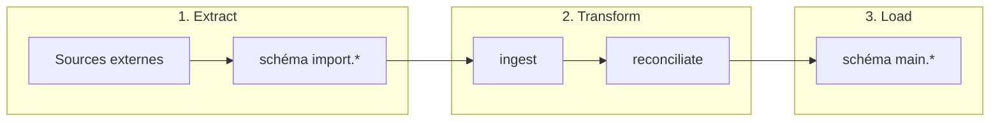

# Data Space — ETL et orchestration

Contexte métier sur le pipeline de données de l'inclusion numérique. Code source : [scripts GitLab](https://gitlab.com/incubateur-territoires/startups/data-space-societe-numerique/scripts).

## Architecture ETL

| Étape | Dossier | Rôle |
|-------|---------|------|
| Extract | `etl/extract` | Copie brute des sources vers `import.{source}__{table}` |
| Transform — ingest | `etl/transform/ingest` | Nettoyage, renommage, UUID par source |
| Transform — reconciliate | `etl/transform/reconciliate` | Fusion, déduplication (adresses, personnes, structures) |
| Load | `etl/load` | Écriture finale dans le schéma `main` |

Orchestration : **Airflow** via `dag.py` à la racine du dépôt. La CI/CD déploie sur `main`.

## Schémas Postgres

| Schéma | Usage |
|--------|-------|
| `import` | Données brutes par source (`{produit}__{table}`) |
| `main` | Données finales (structures, personnes, lieux, etc.) |
| `admin` | Référentiels territoriaux (communes, IFN, zonages) |
| `min` | Application gouvernance |
| `reference` | Nomenclatures (NAF, catégories juridiques) |
| `llm` | Vues anonymisées pour Nao (sans PII) |

## Sources connues

Les connecteurs sont dans `etl/extract/connectors/`. Les sources alimentent notamment :

- Coop numérique (activités, utilisateurs)
- Aidants Connect
- idposte / Conseillers numériques
- Cartographie nationale (mednum-cli)
- SIRENE

## Privacy — tables sensibles dans le pipeline

Les étapes **reconciliate** fusionnent explicitement les **personnes**, **adresses** et **structures** (`merge.py`, `deduplicate.py`). Ces scripts manipulent des PII en base mais le code ETL lui-même ne contient pas de données personnelles.

Pour l'agent Nao :

- Consulter ce dépôt pour comprendre **comment** les données arrivent en `main.*`
- Ne jamais requêter les tables sources brutes contenant des PII (voir `agent/semantics/privacy.md`)
- Privilégier les vues `llm.*` pour les analyses (voir `agent/semantics/privacy.md`)

## Référentiels géographiques

Le DAG `init_ref_data` alimente `admin.*` (communes, départements, régions, codes postaux). Dépendances serveur : `7zip`, `postgis`.

## API exposée

Une API REST **PostgREST** expose des vues du schéma `api`. Les tokens sont liés à des rôles Postgres dédiés (`postgrest_{entité}_{usage}`). Voir la section API du README du dépôt scripts.

## Connexions Airflow

Identifiants de connexion DB courants : `sonum-test-db`, `sonum-dev-db`, `sonum-prod-db`.

## Questions types que l'agent peut traiter

- « D'où viennent les données de `main.lieu_inclusion` ? » → trace via ingest + reconciliate
- « Quelle est la convention de nommage des tables `import` ? » → `{source}__{table}`
- « Comment sont dédupliquées les structures ? » → `etl/transform/reconciliate/deduplicate.py`

## Liens

- Application MIN : `agent/semantics/mon-inclusion-numerique.md`
- Privacy : `agent/semantics/privacy.md`
