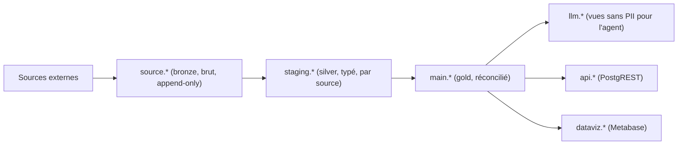

# Data Space — pipeline de données

Contexte sur le pipeline qui alimente l'entrepôt. Code source synchronisé dans
`repos/data-space-scripts/` (GitLab :
[scripts](https://gitlab.com/incubateur-territoires/startups/data-space-societe-numerique/scripts)).

## Architecture (médaillon)

```mermaid
flowchart LR
  Sources[Sources externes] --> Source["source.* (bronze, brut, append-only)"]
  Source --> Staging["staging.* (silver, typé, par source)"]
  Staging --> Main["main.* (gold, réconcilié)"]
  Main --> Llm["llm.* (vues sans PII pour l'agent)"]
  Main --> Api["api.* (PostgREST)"]
  Main --> Dataviz["dataviz.* (Metabase)"]
```

| Étape | Schéma | Rôle |
|-------|--------|------|
| Capture brute | `source.{flux}` | Charge utile brute de chaque appel, une table par flux |
| Silver | `staging.{source}__{table}` | Tables typées, rechargées à chaque run ; caches SIRENE et géocodage ; `staging.rejets` (quarantaine qualité) |
| Transform | code Python `etl/core/` | Règles métier pures, testées unitairement |
| Load | `main.*` | Upserts dans le modèle final (structures, lieux, personnes, postes, contrats) |

Orchestration : **Airflow**, un DAG par source à la racine du dépôt (`coop-dag.py`,
`aidants-connect-dag.py`, `carto-dag-import.py`, `schema-idPoste.py`,
`personne-reconciliation-dag.py`, `lieu-appariement-dag.py`, `zonage-*-dag.py`,
`sirene-backfill-dag.py`, `opendata.py`). Migrations de schéma : **Flyway**
(`database/migrations/V<num>_<date>__<sujet>.sql`), dont les en-têtes commentés sont la
meilleure documentation des règles métier.

L'agent ne lit pas `source.*` ni `staging.*` : seules `main.*` (tables pseudonymisées),
`llm.*`, `admin.*`, `reference.*` et une partie de `min.*` lui sont ouvertes (voir
`privacy.md`).

## Sources

| Source | Ce qu'elle apporte | DAG |
|--------|--------------------|-----|
| Coop de la médiation numérique | médiateurs, structures employeuses, lieux d'activité, activités | `coop-dag.py` (lecture d'une réplique `coop.*`) |
| Aidants Connect | aidants habilités, structures, accompagnements | `aidants-connect-dag.py` |
| idposte / Conseillers numériques | postes, contrats, subventions, formations | `schema-idPoste.py` |
| Cartographie nationale (fichier national) | lieux d'inclusion publics | `carto-dag-import.py` |
| SIRENE (INSEE) | dénomination, état, NAF, catégorie juridique | enrichissement en cache |
| BAN / IGN | géocodage des adresses | enrichissement en cache |
| IGN / INSEE | référentiels `admin.*` (communes, EPCI, zonages) | `init_ref_data.py`, `zonage-*-dag.py` |
| Mon inclusion numérique | gouvernances, membres, journal des modifications | écriture directe dans `min.*`, journal capté dans `source.min__evenements` |

## Réconciliation

- **Personnes** : une même personne peut venir de plusieurs sources ; les doublons sont
  fusionnés (`personne-reconciliation-dag.py`), trace dans `llm.personne_merge_log`.
- **Structures** : fusion par similarité ou manuelle depuis l'admin MIN, trace dans
  `llm.structure_merge_log` ; la perdante reçoit `deleted_at`.
- **Lieux** : rapprochement Coop ↔ cartographie nationale scoré (nom, adresse,
  distance), mémoire dans `llm.lieu_appariement`, décisions humaines conservées.

## Questions types

- « D'où vient telle colonne de `main.poste` ? » → `schema-idPoste.py`, `etl/load/`.
- « Pourquoi une structure a-t-elle deux lignes ? » → siège + antenne, ou recréation
  après fusion (voir `modele-donnees.md`).
- « Quelle règle définit un contrat actif ? » → `date_rupture IS NULL`
  (`CHANGELOG.md` du dépôt, entrée du 2026-09-14).
