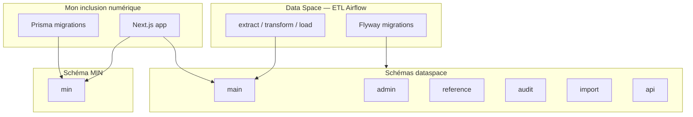

# Mon inclusion numérique (MIN)

Application de gouvernance territoriale de l'inclusion numérique, développée par l'ANCT dans le cadre de [France Numérique Ensemble](https://beta.gouv.fr/startups/france-numerique-ensemble.html).

- **Production gestionnaire :** https://mon.inclusion-numerique.anct.gouv.fr/connexion
- **Code source :** [anct-cnum/suite-gestionnaire-numerique](https://github.com/anct-cnum/suite-gestionnaire-numerique)
- **Stack :** Next.js, TypeScript, Prisma, PostgreSQL

## Rôle dans l'écosystème données

MIN et le [Data Space](https://gitlab.com/incubateur-territoires/startups/data-space-societe-numerique/scripts) **partagent la même base PostgreSQL** avec des responsabilités distinctes :



| Schéma | Propriétaire | Outil de migration |
|--------|--------------|-------------------|
| `admin`, `main`, `reference`, `audit` | Data Space | Flyway |
| `min` | MIN | Prisma |
| `api`, `auth`, `import`, `dataviz`, `pseudonymisation` | Data Space | Flyway (non utilisé côté MIN) |

En production, MIN ne joue **pas** les migrations Prisma sur les schémas non-`min` : seul le schéma `min` est sous sa responsabilité. Voir `docs/integration-dataspace.md` dans le repo synchronisé.

## Données créées ou consommées par MIN

### Schéma `min` (écriture MIN)

Tables métier gouvernance — plusieurs contiennent des **PII** (voir `agent/semantics/privacy.md`) :

| Table | Usage | Privacy |
|-------|-------|---------|
| `min.utilisateur` | Comptes gestionnaires territoriaux | Tier 1 — interdit |
| `min.membre` | Membres de gouvernance | Tier 1 — interdit |
| `min.contact_membre_gouvernance` | Contacts gouvernance | Tier 1 — interdit |
| `min.gouvernance` | Notes de contexte par département | Tier 2 — interdit |
| `min.action`, `min.demande_de_subvention` | Pilotage FNE | Tier 2 — interdit |
| `min.feuille_de_route`, `min.comite` | Feuilles de route, comités | Tier 2 — interdit |
| `min.departement`, `min.region`, `min.groupement` | Référentiels territoriaux | Tier 4 — autorisé |
| `min.enveloppe_financement`, `min.departement_enveloppe` | Enveloppes budgétaires | Tier 4 — autorisé |
| `min.structure` | Structures côté MIN | Tier 3 — vue `analytics.min_structure_publique` |
| `min.personne_enrichie` | Vue enrichie médiateurs | Tier 1 — interdit |

### Schéma `main` (lecture MIN, écriture Data Space)

MIN **lit** intensivement `main.*` pour les statistiques et la cartographie, notamment :

- `main.activites_coop` — activités Coop numérique (statistiques médiateurs)
- `main.personne`, `min.personne_enrichie` — résolution des filtres médiateurs (usage interne app, **interdit pour Nao**)
- `main.structure`, `main.adresse` — lieux et structures

Documentation détaillée des mappings : `docs/couche-anticorruption-statistiques.md` dans le repo.

### Postes Conseiller Numérique

MIN consomme `main.poste`, `main.subvention` et la vue `min.postes_conseiller_numerique_synthese`. Voir `docs/postes-conseiller-numerique.md`.

Pour Nao : utiliser `analytics.postes_synthese` (sans `personne_id`) et `main.subvention`.

## Couche anticorruption statistiques

MIN traduit entre deux domaines :

- **SGN** : `ScopeFiltre` (national / département / structure), IDs entiers, labels PascalCase
- **Coop** : `coop_id` UUID, `activites_coop.type` en lowercase, thématiques human-readable

Règle clé pour l'agent : `personne_id`, `coop_id` et `structure_id` bruts **ne doivent jamais apparaître** dans les réponses analytics — MIN les filtre via son ACL ; Nao doit faire de même.

## Fichiers clés dans le repo synchronisé

| Chemin | Intérêt |
|--------|---------|
| `prisma/schema.prisma` | Modèle de données Prisma (tous schémas) |
| `docs/integration-dataspace.md` | Partage BDD MIN ↔ Data Space |
| `docs/couche-anticorruption-statistiques.md` | Mappings statistiques Coop |
| `docs/postes-conseiller-numerique.md` | Logique métier postes CN |
| `src/use-cases/` | Cas d'usage métier |
| `src/gateways/` | Accès données (Prisma, API) |
| `src/domain/` | Entités et règles domaine |

## Synchronisation schéma en développement

```bash
pnpm db:sync-dataspace   # régénère la migration dataspace depuis la BDD locale
```

Script : `scripts/sync-dataspace-migration.sh`

## Questions types que l'agent peut traiter

- « Qui possède le schéma `min` ? » → MIN via Prisma
- « Comment MIN filtre les statistiques par département ? » → `lieu_code_insee` + règles DOM-TOM dans `PrismaStatistiquesLoader`
- « Quelle table pour les enveloppes budgétaires ? » → `min.enveloppe_financement`
- « Peut-on lister les emails des gestionnaires ? » → **Refus** (`min.utilisateur` Tier 1)

## Liens

- Pipeline ETL : `agent/semantics/dataspace-etl.md`
- Privacy : `agent/semantics/privacy.md`
