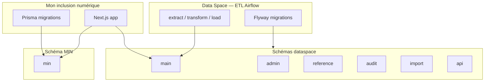

# Mon inclusion numérique (MIN)

Application de gouvernance territoriale de l'inclusion numérique, développée par l'ANCT dans le cadre de [France Numérique Ensemble](https://beta.gouv.fr/startups/france-numerique-ensemble.html).

- **Production gestionnaire :** https://mon.inclusion-numerique.anct.gouv.fr/connexion
- **Code source :** [anct-cnum/suite-gestionnaire-numerique](https://github.com/anct-cnum/suite-gestionnaire-numerique)
- **Stack :** Next.js, TypeScript, Prisma, PostgreSQL

## Rôle dans l'écosystème données

MIN et le [Data Space](https://gitlab.com/incubateur-territoires/startups/data-space-societe-numerique/scripts) **partagent la même base PostgreSQL** avec des responsabilités distinctes :


```mermaid
flowchart TB
  subgraph dataspace [Data Space — ETL Airflow]
    ETL[extract / transform / load]
    Flyway[Flyway migrations]
  end
  subgraph schemas_ds [Schémas dataspace]
    admin[admin]
    main[main]
    reference[reference]
    audit[audit]
    import_s[import]
    api[api]
  end
  subgraph min_app [Mon inclusion numérique]
    Prisma[Prisma migrations]
    Next[Next.js app]
  end
  subgraph schema_min [Schéma MIN]
    min_s[min]
  end
  ETL --> main
  Flyway --> schemas_ds
  Prisma --> min_s
  Next --> min_s
  Next --> main
```

| Schéma | Propriétaire | Outil de migration |
|--------|--------------|-------------------|
| `admin`, `main`, `reference`, `audit` | Data Space | Flyway |
| `min` | MIN | Prisma |
| `api`, `auth`, `import`, `dataviz`, `pseudonymisation` | Data Space | Flyway (non utilisé côté MIN) |

En production, MIN ne joue **pas** les migrations Prisma sur les schémas non-`min` : seul le schéma `min` est sous sa responsabilité. Voir `docs/integration-dataspace.md` dans le repo synchronisé.

## Données créées ou consommées par MIN

### Schéma `min` (écriture MIN)

Tables métier gouvernance et ce que l'agent en voit (détail dans `agent/semantics/privacy.md`) :

| Table | Usage | Pour l'agent |
|-------|-------|--------------|
| `min.utilisateur` | Comptes gestionnaires territoriaux | `llm.utilisateur` (rôle, territoire, dates ; identité masquée) |
| `min.membre` | Membres de gouvernance = **organisations** (EPCI, communes, préfectures, associations…) | `llm.membre` (sans les courriels de contact) |
| `min.contact_membre_gouvernance` | Personnes de contact des membres | non exposée (100 % nominative) |
| `min.gouvernance` | Note de contexte et note privée par département | `llm.gouvernance` (note de contexte avec coordonnées masquées, sans note privée) |
| `min.action`, `min.demande_de_subvention`, `min.co_financement`, `min.beneficiaire_subvention`, `min.porteur_action` | Pilotage FNE | accès direct |
| `min.feuille_de_route`, `min.comite` | Feuilles de route, comités | accès direct |
| `min.departement`, `min.region`, `min.groupement` | Référentiels territoriaux | accès direct |
| `min.enveloppe_financement`, `min.departement_enveloppe` | Enveloppes budgétaires | accès direct |
| `min.postes_conseiller_numerique_synthese` | Synthèse postes CN (subventions, versements) | accès direct |
| `min.structure` | Ancien référentiel de structures, **déprécié** (les `structure_id` pointent `main.structure_administrative`) | `llm.structure`, à ne plus utiliser |
| `min.personne_enrichie` | Vue enrichie médiateurs | `llm.personne_enrichie` (drapeaux d'activité, identité masquée) |

### Schéma `main` (lecture MIN, écriture Data Space)

MIN **lit** intensivement `main.*` pour les statistiques et la cartographie, notamment :

- `main.activites_coop` — activités Coop numérique (statistiques médiateurs ; l'agent passe par `llm.activites_coop`)
- `main.personne`, `min.personne_enrichie` — résolution des filtres médiateurs (l'agent passe par `llm.personne` / `llm.personne_enrichie`)
- `main.structure_administrative`, `main.lieu_inclusion`, `main.adresse` — structures, lieux, adresses (l'agent passe par `llm.structure_administrative`, `llm.lieu_inclusion`, `llm.adresse`)

Documentation détaillée des mappings : `docs/couche-anticorruption-statistiques.md` dans le repo.

### Postes Conseiller Numérique

MIN consomme `main.poste`, `main.subvention` et la vue `min.postes_conseiller_numerique_synthese`. Voir `docs/postes-conseiller-numerique.md`.

Pour l'agent : `main.poste`, `main.contrat`, `main.subvention` et `min.postes_conseiller_numerique_synthese` sont en accès direct ; le titulaire d'un poste se lit dans `llm.personne` (identité masquée).

## Couche anticorruption statistiques

MIN traduit entre deux domaines :

- **SGN** : `ScopeFiltre` (national / département / structure), IDs entiers, labels PascalCase
- **Coop** : `coop_id` UUID, `activites_coop.type` en lowercase, thématiques human-readable

Règle clé pour l'agent : `personne_id`, `coop_id` et `structure_id` bruts **ne doivent jamais apparaître** dans les réponses analytics — MIN les filtre via son ACL ; Nao doit faire de même.

## Fichiers clés dans le repo synchronisé

| Chemin | Intérêt |
|--------|---------|
| `prisma/schema.prisma` | Modèle de données Prisma (tous schémas) |
| `docs/integration-dataspace.md` | Partage BDD MIN ↔ Data Space |
| `docs/couche-anticorruption-statistiques.md` | Mappings statistiques Coop |
| `docs/postes-conseiller-numerique.md` | Logique métier postes CN |
| `src/use-cases/` | Cas d'usage métier |
| `src/gateways/` | Accès données (Prisma, API) |
| `src/domain/` | Entités et règles domaine |

## Synchronisation schéma en développement

```bash
pnpm db:sync-dataspace   # régénère la migration dataspace depuis la BDD locale
```

Script : `scripts/sync-dataspace-migration.sh`

## Questions types que l'agent peut traiter

- « Qui possède le schéma `min` ? » → MIN via Prisma
- « Comment MIN filtre les statistiques par département ? » → `lieu_code_insee` + règles DOM-TOM dans `PrismaStatistiquesLoader`
- « Quelle table pour les enveloppes budgétaires ? » → `min.enveloppe_financement`
- « Peut-on lister les emails des gestionnaires ? » → impossible, la base ne les expose pas ; proposer le décompte par rôle et département (`llm.utilisateur`)
- « Que s'est-il passé pour le membre epci-200068641-31 ? » → `llm.membre` (statut, date de suppression, `structure_id`), puis `llm.evenement` (`entity_id` = cet id texte) et `llm.structure_merge_log` sur la structure rattachée

## Liens

- Pipeline ETL : `agent/semantics/dataspace-etl.md`
- Privacy : `agent/semantics/privacy.md`
