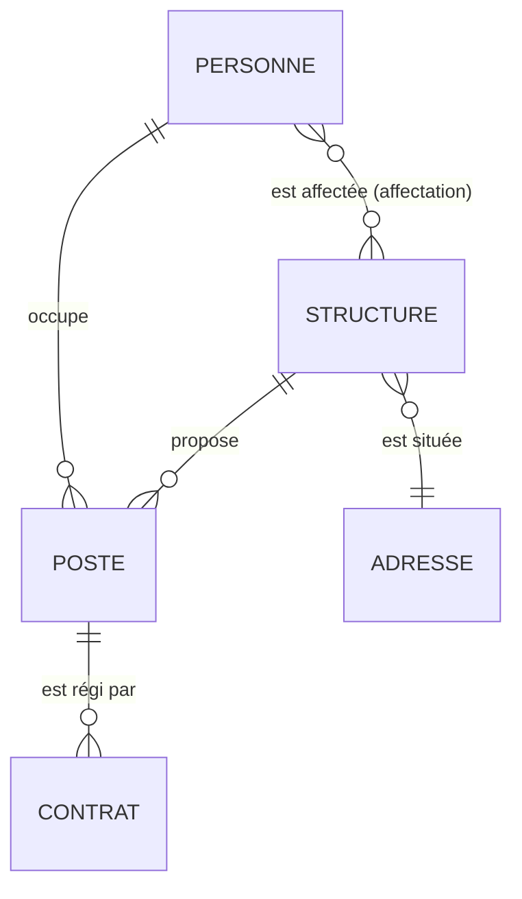

# 10 — Modélisation de la couche gold

← [Retour au document central](README.md)

## Le concept

La modélisation de données répond à : **comment structurer les tables finales pour que le
modèle serve les usages, résiste aux évolutions et soit compréhensible ?** C'est la
discipline la plus ancienne du métier — et la plus souvent sautée par les équipes qui
"font juste des tables au fil des besoins" (ce qui produit, des années plus tard, un
schéma que personne n'ose toucher).

Trois écoles principales, qui répondent à des usages différents :

| École | Principe | Optimisé pour | Usage ici |
|-------|----------|---------------|-----------|
| **Relationnel normalisé (3NF)** — Codd/Inmon | Éliminer la redondance : chaque fait stocké une fois, relations par FK | Écriture, intégrité, applications transactionnelles | **`main`** (consommé par MIN : lectures/écritures unitaires, intégrité forte) |
| **Dimensionnel (étoile)** — Kimball | Tables de **faits** (événements, mesures) entourées de **dimensions** (axes d'analyse) dénormalisées | Lecture analytique, agrégations, compréhension métier | **`dataviz`** (Metabase : agrégats par territoire, temps, type) |
| **Data Vault** — Linstedt | Hubs (clés métier) / Links (relations) / Satellites (attributs historisés) | Intégration multi-sources à très grande échelle, auditabilité | Voir "Aller plus loin" en fin de fiche |

Le point clé : **une même donnée est modélisée différemment selon la couche** — normalisée
en `main`, dimensionnelle en `dataviz`. Ce n'est pas de la duplication, c'est de
l'adaptation à l'usage. C'est exactement ce que l'architecture en couches (fiche 01) rend
possible.

## État actuel du projet

- Le modèle `main` (structure, personne, poste, contrat, adresse, affectations…) existe et
  est globalement relationnel — mais il n'a **jamais été formalisé** : pas de diagramme
  entité-association maintenu, pas de définition écrite de la granularité de chaque table
  ("une ligne de `poste` représente quoi, exactement ?"), pas de règles de nommage
  documentées.
- Conséquences observables : les migrations successives d'ajustement (contraintes ajoutées
  après coup, tables d'association créées puis supprimées comme lieu ↔ structure
  administrative) témoignent d'un modèle découvert en marchant plutôt que conçu.
- `dataviz` : des vues matérialisées construites au besoin par dashboard, sans modèle
  dimensionnel — chaque nouvelle question métier redéclenche du SQL ad hoc au lieu de
  réutiliser des dimensions partagées.

## Mise en place sur ce projet

### 1. Formaliser le modèle `main` existant (rétro-documentation)

Avant de le faire évoluer, l'écrire :

- **Diagramme entité-association** maintenu dans le repo (Mermaid dans un markdown : versionnable, diffable, affiché par GitLab) :



- **Fiche de granularité par table** — le document qui manque le plus. Pour chaque table :
  *"une ligne = ..."*, la clé naturelle, les invariants (ex. "une personne a au plus un
  poste actif par structure"). La moitié des bugs de réconciliation viennent d'un désaccord
  implicite sur la granularité.
- Croiser avec le dictionnaire de données (fiche 07) : la modélisation donne le squelette,
  le dictionnaire la chair.

### 2. Conventions de nommage et de conception

À écrire une fois, à appliquer dans chaque migration ensuite :

- Tables au singulier ou pluriel (l'existant mélange — trancher et s'y tenir pour le neuf),
  français cohérent, `snake_case`.
- Clés : `id` (UUID pivot) ; FK nommées `<table>_id` ; clés naturelles déclarées `UNIQUE`
  même quand la PK est technique (c'est ce qui rend les `ON CONFLICT` fiables — point de
  douleur déjà rencontré).
- Colonnes de traçabilité systématiques : `created_at`, `updated_at`, et la provenance par
  champ quand pertinent (fiche 04).
- Booléens nommés en prédicat (`is_visible`, `est_actif`), jamais de sémantique inversée.
- Pas de colonnes "fourre-tout" jsonb en gold, sauf décision explicite documentée (le
  jsonb est légitime en bronze et pour `audit_trail`, pas pour porter des attributs métier
  requêtés).

### 3. Un modèle dimensionnel pour `dataviz`

Plutôt que des vues ad hoc par dashboard, un petit schéma en étoile :

```
dim_territoire (commune, EPCI, département, région, zonages)   ← déjà en germe (reference, zonage)
dim_temps      (jour, semaine, mois, trimestre)
dim_structure  (typologie, statut — version dénormalisée de main)
fait_activite  (accompagnements/postes par structure × territoire × temps)
fait_presence  (snapshots mensuels des structures — lien fiche 09)
```

- Chaque nouveau dashboard Metabase **réutilise** ces dimensions au lieu de recoder les
  jointures territoire/temps — cohérence des chiffres entre dashboards garantie par
  construction (deux dashboards qui donnent deux totaux différents pour "structures par
  département" : c'est le symptôme classique de l'absence de modèle dimensionnel).
- Les snapshots de la fiche 09 s'insèrent naturellement comme table de faits.
- Si dbt est adopté (fiche 05), c'est la couche `marts` analytique — modèles + tests +
  docs générés.

### 4. Processus : la modélisation comme étape de conception

Règle d'équipe : **tout ajout de table ou de relation passe par une mise à jour du
diagramme et de la fiche de granularité, dans la même MR que la migration.** Une évolution
de modèle se discute sur le diagramme (10 minutes, tout le monde comprend) avant de
s'écrire en SQL — c'est l'inverse de la pratique actuelle où le modèle est la conséquence
des migrations.

## Par où commencer

1. Rétro-documenter `main` : diagramme Mermaid + fiches de granularité (2-3 jours, aucune
   modification de code).
2. Écrire la convention de nommage/conception (1 page).
3. Concevoir `dim_territoire` + `dim_temps` et refondre un dashboard Metabase dessus comme
   pilote.

## Pièges connus

- **Dénormaliser `main` "pour la perf"** : les volumes ici ne le justifient pas ; la
  dénormalisation appartient à `dataviz`. Un `main` dénormalisé rend le MDM (fiche 04)
  ingérable.
- **Le diagramme d'inauguration** : fait une fois, jamais maintenu, faux au bout de 3 mois
  — pire que pas de diagramme. D'où la règle "même MR que la migration".
- **Modéliser dans l'abstrait** : partir des questions réelles (les dashboards existants,
  les requêtes MIN) — un modèle se valide contre des usages, pas contre l'élégance.

## Aller plus loin

- **Data Vault 2.0** : pertinent quand on intègre des dizaines de sources volatiles avec
  exigence d'audit total — les hubs/links/satellites absorbent les changements de sources
  sans refonte. À cette échelle (4-5 sources stables), le rapport complexité/valeur est
  défavorable : la couche bronze + le crosswalk MDM en donnent les bénéfices essentiels.
  Signal de bascule : si le nombre de sources dépasse la dizaine avec du churn.
- **One Big Table (OBT)** : dénormalisation extrême en une table large par usage,
  popularisée par les entrepôts columnaires (BigQuery). Sur PostgreSQL row-store, sans
  intérêt — nos vues matérialisées `dataviz` en sont l'équivalent pragmatique.
- **Modélisation par graphe** (Neo4j, pgRouting) : si un jour l'analyse porte sur le
  *réseau* (chaînes de coordination, parcours entre structures), un modèle graphe devient
  pertinent. PostgreSQL couvre les besoins actuels avec des CTE récursives.

## Références

- Kimball — *The Data Warehouse Toolkit* (dimensionnel, la référence)
- *Database Design for Mere Mortals* (Hernandez) — conception relationnelle pragmatique
- dbt Labs — *How we structure our dbt projects* (staging/intermediate/marts)
- Mermaid `erDiagram` — diagrammes versionnés dans le repo
