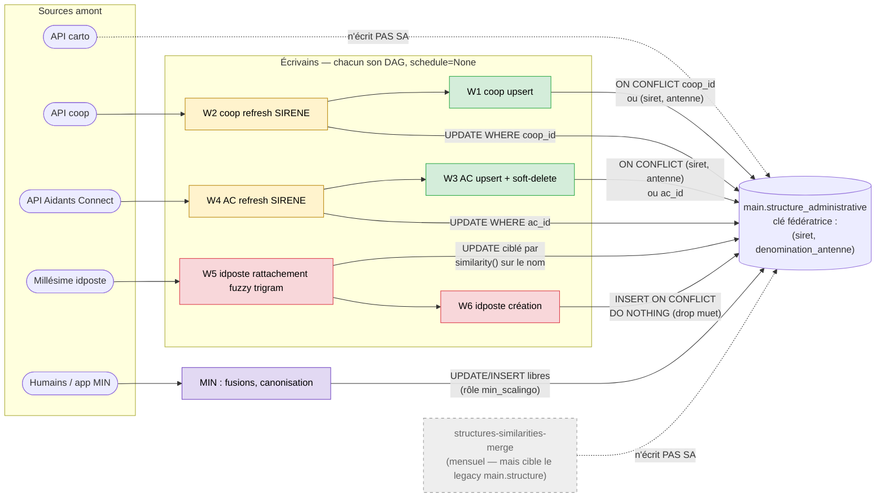
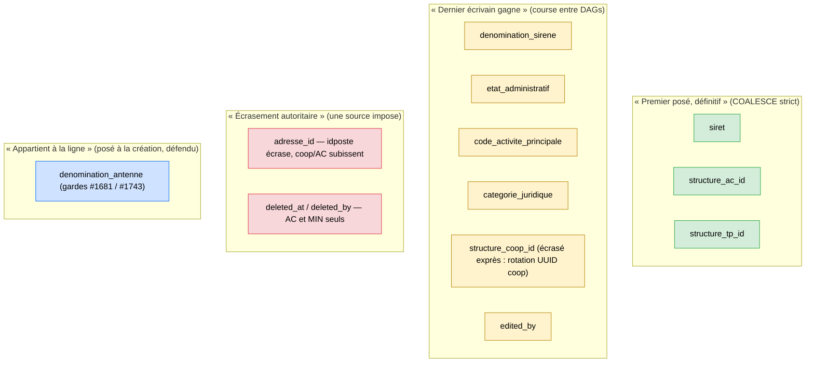
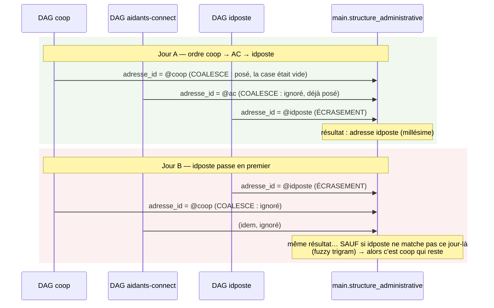
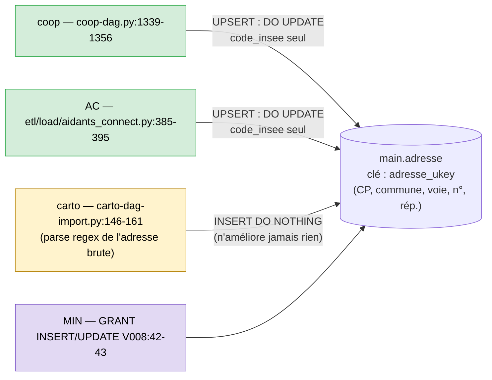
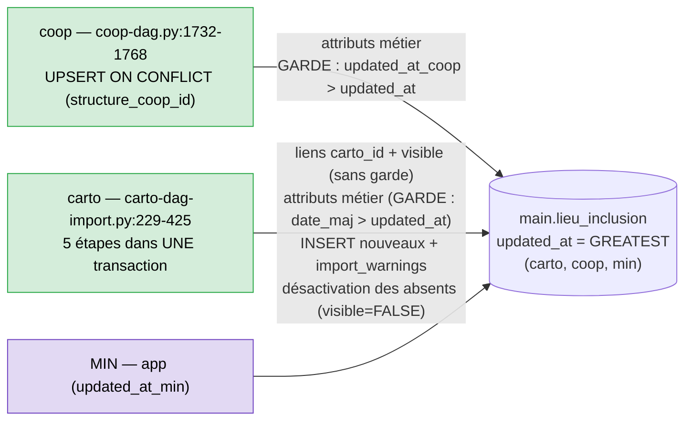
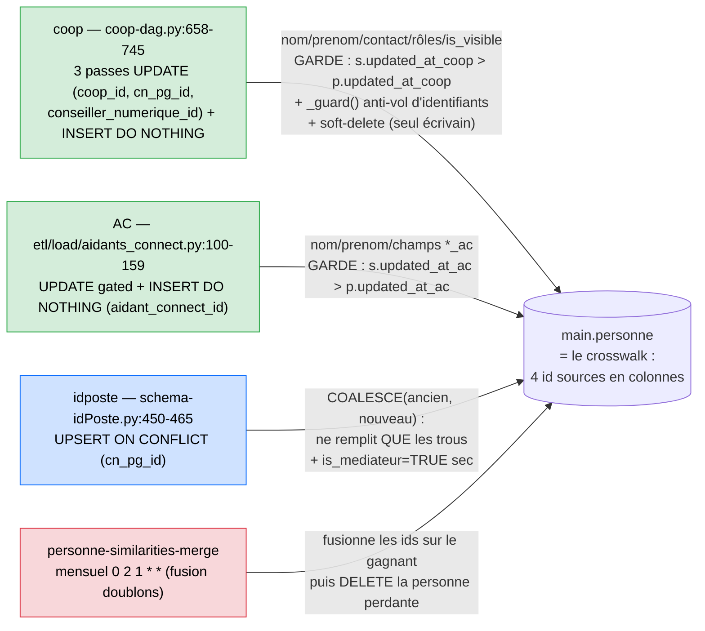
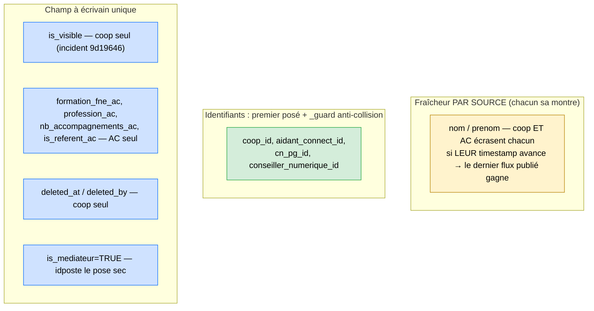
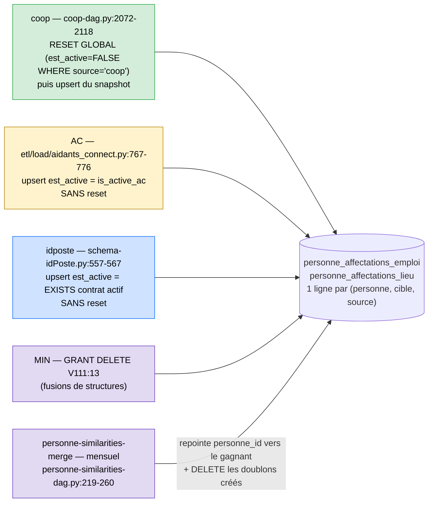
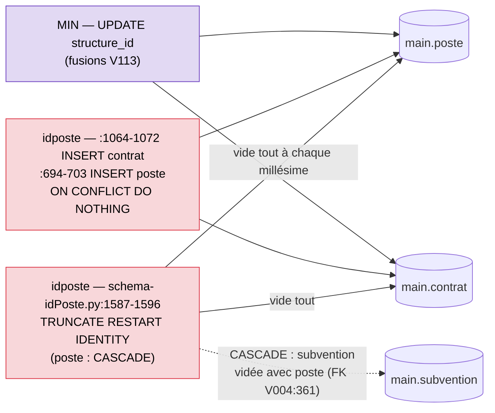
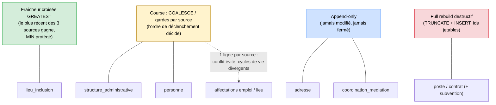

# 18 — Cartographie des écritures vers le gold (`main.*`)

> Rétro-ingénierie factuelle : qui écrit quoi dans chaque table `main.*`, avec quelle clé,
> quelles règles de survivance CONSTATÉES (celles que le code applique, pas celles qu'on
> voudrait). Support de l'étape 3 de la [feuille de route](../plateforme-data/feuille-de-route.md) :
> chaque règle constatée devra être validée ou invalidée (métier), la cible du gold
> sortira de cet exercice. Zéro interprétation dans les sections « constaté » ; les
> questions ouvertes sont regroupées en fin de section.
>
> Méthode : lecture exhaustive des sites d'écriture (`grep INSERT/UPDATE/DELETE main.<table>`
> sur tout le repo), croisée avec les contraintes réelles des migrations. Les références
> `fichier:ligne` datent du 2026-07-30.

## Table des matières

- [main.structure_administrative](#mainstructure_administrative) — fait
- [main.adresse](#mainadresse) — fait
- [main.lieu_inclusion](#mainlieu_inclusion) — fait
- [main.personne](#mainpersonne) — fait
- [main.personne_affectations_emploi / _lieu](#mainpersonne_affectations_emploi--mainpersonne_affectations_lieu) — fait
- [main.coordination_mediation](#maincoordination_mediation) — fait
- [main.poste / main.contrat](#mainposte--maincontrat) — fait
- [main.ac_accompagnements_mensuels](#mainac_accompagnements_mensuels) — fait
- [DAGs de fusion mensuels (similarities-merge)](#dags-de-fusion-mensuels-similarities-merge) — fait

---

## main.structure_administrative

**Définition** (V068, commentaire de table) : entité légale (SIRET/RIDET) qui peut employer
des médiateurs, bénéficier de subventions, héberger des lieux d'inclusion. Successeur de
`main.structure` (refonte 2026-05).

### Identité et clés (V068 — ce sont les clés de matching de fait)

| Contrainte | Colonnes | Rôle de fait |
|---|---|---|
| `siret_antenne_ukey` | `(siret, denomination_antenne)` UNIQUE **NULLS NOT DISTINCT** | Clé fédératrice cross-source : « antenne » = discriminant grand réseau ; `(siret, NULL)` = SA canonique unique |
| `structure_coop_id_ukey` | `structure_coop_id` | Identifiant source coop |
| `structure_ac_id_ukey` | `structure_ac_id` | Identifiant source Aidants Connect |
| `structure_tp_id_ukey` | `structure_tp_id` | Identifiant source idposte (conseillers numériques) |
| `ridet_ukey` | `ridet` | NC/Polynésie (aucun écrivain ETL constaté) |
| `old_main_structure_id_ukey` | `old_main_structure_id` | Audit refonte, à dropper phase 6 |

Marqueurs de provenance : `edited_by` (dernier écrivain), `updated_at_coop` / `updated_at_ac`
/ `updated_at_idposte` (fraîcheur par source), `deleted_by` TEXT[] (cumul des sources ayant
soft-deleté), `last_sirene_enrich_at` (gate TTL enrichissement).

### Vue d'ensemble — qui écrit, par quelle porte

Légende : vert = upsert « propriétaire » d'un id source ; jaune = refresh SIRENE
(COALESCE, sans risque) ; rouge = les deux sites à risque (fuzzy sans seuil, drop
silencieux) ; violet = écriture humaine ; gris pointillé = chemin inactif.

### Écrivains (runtime ETL)

| # | Écrivain | Site | Mode | Clé de conflit | Champs écrits | Quand |
|---|---|---|---|---|---|---|
| W1 | **coop** — `structures_ingest` | coop-dag.py:1594-1694 | UPSERT 2 chemins : existants + nouveaux sans SIRET → `ON CONFLICT (structure_coop_id)` ; nouveaux avec SIRET → `ON CONFLICT siret_antenne_ukey` | `structure_coop_id` OU `(siret, denomination_antenne)` | siret, rna, denomination_sirene, code_activite_principale, categorie_juridique, etat_administratif, adresse_id, structure_coop_id, denomination_antenne, contact, edited_by='coop', updated_at_coop | DAG `coop-import`, `schedule=None` (déclenchement manuel/externe) |
| W2 | **coop** — `enrich_structures_batch` | coop-dag.py:486-497 | UPDATE batch (refresh SIRENE des SA existantes) | `WHERE structure_coop_id = …` | etat_administratif, code_activite_principale, categorie_juridique, denomination_sirene (tous COALESCE), last_sirene_enrich_at | Même DAG, tâche amont de W1 |
| W3 | **aidants-connect** — `ingest_structures` | etl/load/aidants_connect.py:453-663 | UPSERT 2 chemins : avec SIRET → `ON CONFLICT siret_antenne_ukey` ; sans SIRET → `ON CONFLICT (structure_ac_id)` | `(siret, denomination_antenne)` OU `structure_ac_id` | structure_ac_id, siret, denomination_antenne (création seulement), adresse_id, etat_administratif, code_activite_principale, categorie_juridique, denomination_sirene, nb_mandats_ac, deleted_at, deleted_by, edited_by='aidants-connect', updated_at_ac | DAG `aidants-connect-import`, `schedule=None` |
| W4 | **aidants-connect** — `enrich_structures_batch` | aidants-connect-dag.py:619-627 | UPDATE batch (refresh SIRENE) | `WHERE structure_ac_id = …` | mêmes champs que W2 | Même DAG, amont de W3 |
| W5 | **idposte** — `process_enriched_structure` étape 3 | schema-idPoste.py:1364-1398 | UPDATE « rattachement » : pose `structure_tp_id` sur une SA existante SANS tp_id, choisie par `(siret, adresse_id)` + **similarity() trigram sur le nom** | sous-requête : `siret = …` AND `adresse_id IS NOT DISTINCT FROM …` AND `structure_tp_id IS NULL`, meilleur score trigram, garde NOT EXISTS (tp_id jamais ré-attaché) | structure_tp_id, **adresse_id (écrasement, PAS de COALESCE)**, etat_administratif, code_activite_principale, categorie_juridique, denomination_sirene (COALESCE), edited_by='id-poste' | DAG `schema-idPoste`, `schedule=None` (millésimes) |
| W6 | **idposte** — étape 4 | schema-idPoste.py:1430-1432 | INSERT `ON CONFLICT DO NOTHING` (création si le rattachement W5 n'a rien trouvé) | aucune (DO NOTHING sur toute collision) | adresse_id + structure_columns + edited_by='id-poste' | Même DAG, après W5 |

### Écrivains hors ETL

| Écrivain | Droit / site | Nature |
|---|---|---|
| **MIN (app)** | rôle `min_scalingo` : SELECT, INSERT, UPDATE (V091:45-46) | Écriture humaine : fusions de doublons, canonisation (`denomination_antenne` → NULL), migration d'identifiants source. Tracée uniquement dans `source.min__evenements` (V124). Pas de DELETE (les fusions V113 portent sur poste/contrat/lien LI-SA) |

### Non-écrivains notables (à contre-intuition)

- **carto** : n'écrit PAS cette table (carto-dag-import.py:166-170 — les attributs SIRENE
  appartiennent à SA, carto ne fait que du matching par carto_id/coop_id sur les LI).
- **La réconciliation cross-source** (`etl/transform/reconciliate/`) : n'écrit PAS cette
  table. Le déclenchement de `structures-similarities-merge` depuis carto est désactivé
  depuis la refonte (carto-dag-import.py:437-441) — MAIS le DAG a son propre
  `schedule="0 2 1 * *"` (mensuel, cf [section fusion](#dags-de-fusion-mensuels-similarities-merge)) ;
  il cible le LEGACY `main.structure`, jamais SA. La dédup inter-sources de SA repose
  donc uniquement sur la clé `(siret, denomination_antenne)` au fil de l'eau + les
  fusions manuelles MIN.

### Survivance constatée — les 4 familles de règles

Chaque champ de SA obéit (de fait) à l'une de ces 4 politiques. Le problème :
elles cohabitent sur la même ligne, et personne ne les a choisies globalement.

### La course : pourquoi le résultat dépend du jour

Les 3 DAGs sont `schedule=None` : l'ordre de passage est celui des déclenchements.
Exemple réel possible sur `adresse_id` d'une même SA (siret partagé) :

Sur les champs « dernier écrivain gagne » (famille jaune), le même mécanisme
joue à chaque run : la valeur en base reflète l'ordre de déclenchement, pas une
règle métier.

### Survivance constatée, champ par champ

| Champ | Règle que le code applique | Qui gagne en pratique |
|---|---|---|
| `siret` | COALESCE partout (jamais écrasé par NULL, jamais remplacé s'il existe — coop W1 chemin coop_id, AC W3 chemin ac_id) | **Premier qui le pose** |
| `denomination_sirene`, `etat_administratif`, `code_activite_principale`, `categorie_juridique` | COALESCE partout (W1-W6) | **Dernier écrivain** (mais la valeur vient de l'API SIRENE via les caches partagés → conflit théorique faible ; divergence possible si millésime idposte périmé) |
| `denomination_antenne` | La plus défendue : posée à la CRÉATION seulement (AC ne la met JAMAIS en DO UPDATE, #1743 ; coop garde anti-réécriture des canoniques #1681 ; redite du nom canonique → NULL ; réalignement casse sur l'existant) | **La structure elle-même** — le nom appartient à la ligne une fois créée, aucune source ne peut le réécrire (post #1681/#1743) |
| `adresse_id` | coop/AC : COALESCE. **idposte W5 : écrasement sec** (`SET adresse_id = v.new_adresse_id`) | **idposte gagne toujours** quand il rattache — même sur une adresse posée par coop/AC |
| `structure_coop_id` | Chemin W1 « nouveaux avec SIRET » : `structure_coop_id = EXCLUDED.structure_coop_id` (écrase — « prend le coop_id le plus récent », gère la rotation d'UUID coop) | **coop, dernier arrivé** |
| `structure_ac_id` | W3 : `COALESCE(existant, EXCLUDED)` — jamais volé | **Premier ac_id posé** |
| `structure_tp_id` | W5 : posé une fois, garde `NOT EXISTS` (jamais ré-attaché ailleurs) | **Premier rattachement idposte, définitif** |
| `deleted_at` / `deleted_by` | **AC seul en ETL** : soft-delete si `is_active_ac=false`, monotone (`deleted_at` ne recule jamais), `deleted_by` cumulatif. coop n'écrit pas ces champs sur SA (le `deleted_at_coop` vit sur d'autres tables). MIN peut aussi | **AC + MIN** |
| `nb_mandats_ac` | COALESCE, AC seul | AC |
| `contact` | COALESCE, coop seul en direct (idposte passe par `main.contact_structure_administrative`) | coop / legacy |
| `edited_by` | Écrasé à chaque écriture | Dernier écrivain (≠ provenance des valeurs, cf COALESCE) |

### Constats et questions ouvertes (matière pour l'étape « décisions »)

1. **Aucun ordre défini entre les écrivains** : les 3 DAGs sont `schedule=None` —
   l'ordre d'exécution (donc le « dernier écrivain gagne » des champs COALESCE) dépend
   du déclenchement manuel/externe. La survivance effective est non déterministe
   inter-jours.
2. **`adresse_id` : deux philosophies incompatibles** — COALESCE (coop/AC : premier
   arrivé) vs écrasement (idposte : autoritaire). Est-ce voulu que l'adresse idposte
   (millésime, potentiellement ancien) écrase une adresse fraîche coop/AC ?
3. **Le matching idposte est fuzzy en SQL** (trigram `similarity()` dans un ORDER BY,
   W5) : seuil implicite = « le meilleur score gagne », même à 0.01. Aucune trace des
   choix effectués (quel score, quelle alternative écartée).
4. **W6 avale ses échecs** : `ON CONFLICT DO NOTHING` sans cible — toute collision
   (siret+antenne déjà pris, tp_id déjà pris…) est silencieuse. C'est un drop silencieux
   de niveau gold, cousin de ceux traités en quarantaine bronze/silver (fiche 03).
5. **La dédup cross-source de fait, c'est la contrainte `(siret, denomination_antenne)`**
   + 3 correctifs de casse/canonisation (#1681, #1743) accumulés dans 2 codebases
   différentes (coop-dag.py et etl/load/aidants_connect.py) qui doivent rester
   synchrones à la main. Le « crosswalk » est implicite : ce sont les 3 colonnes
   `structure_*_id` de la table elle-même.
6. **MIN écrit sans règles publiées** : fusions et canonisations manuelles (légitimes)
   mais leurs invariants (que doit préserver une fusion ?) n'existent que dans le code
   MIN, hors de ce repo. Les gardes ETL (#1681) ont été ajoutées en réaction.
7. **Personne ne désactive jamais une SA côté coop/idposte** : seul AC (et MIN)
   soft-delete. Une SA disparue de coop/idposte reste active indéfiniment.

---

## main.adresse

**Définition** (V004:51-74) : référentiel d'adresses partagé, référencé par SA, LI (et
legacy `main.structure`). Pas de `edited_by`, pas de soft-delete : une adresse
n'appartient à personne.

### Identité et clés

| Contrainte | Colonnes | Rôle de fait |
|---|---|---|
| `adresse_ukey` (V004:69, durcie V067:15-23 en NULLS NOT DISTINCT) | `(code_postal, nom_commune, nom_voie, COALESCE(numero_voie,0), COALESCE(repetition,''))` | LA clé de dédup cross-source — index d'expression, `ON CONFLICT` sur les colonnes |
| `adresse_code_ban_ukey` (V004:66) | `code_ban` | Identifiant BAN quand géocodée |

### Vue d'ensemble

### Survivance constatée

La table est **append-only de fait** : le seul champ jamais mis à jour est
`code_insee` (`COALESCE(EXCLUDED.code_insee, main.adresse.code_insee)` — le nouveau
gagne s'il est non NULL, coop et AC seulement ; carto fait `DO NOTHING`). Aucun
DELETE runtime.

### Constats et questions ouvertes

1. **Aucun ménage** : pas de DELETE runtime, pas de compteur de références → les
   adresses orphelines s'accumulent indéfiniment.
2. **Deux qualités d'adresse cohabitent sous la même clé** : coop/AC insèrent du
   géocodé BAN (clef_interop, code_ban, geom API), carto insère du parse regex de
   chaîne brute (`carto-dag-import.py:148-157`, geom = point long/lat du fichier).
   Premier arrivé gagne la ligne — la version regex peut « prendre la place » de la
   version BAN si carto passe en premier.
3. **`ON CONFLICT` sur les colonnes d'un index d'expression** dupliqué à l'identique
   dans 3 codebases (coop, AC, carto) : tout changement de `adresse_ukey` casse les
   3 en même temps, silencieusement jusqu'au premier run.

---

## main.lieu_inclusion

**Définition** (V069:20-114) : lieu physique d'inclusion numérique (successeur de
`main.structure` côté lieux, refonte 2026-05). C'est la table la plus « aboutie »
du gold : fraîcheur par source + garde d'écrasement symétrique.

### Identité et clés

| Contrainte | Colonnes | Rôle de fait |
|---|---|---|
| `lieu_inclusion_carto_id_ukey` (V069:77-78) | `structure_cartographie_nationale_id` | Identifiant mednum-cli (carto) |
| `lieu_inclusion_structure_coop_id_ukey` (V081:60) | `structure_coop_id` | Identifiant coop |
| `lieu_inclusion_old_main_structure_id_ukey` (V069:79-80) | `old_main_structure_id` | Audit refonte |

Fraîcheur : `updated_at_carto` / `updated_at_coop` / `updated_at_min` (V115), et
**`updated_at` GENERATED = GREATEST des trois** (V116:20-23) — c'est le pivot du
mécanisme de survivance. Cycle de vie : `visible_pour_cartographie_nationale`
(pas de `deleted_at`).

### Vue d'ensemble

Détail carto (l'écrivain le plus riche, `carto-dag-import.py:229-425`) :

| Étape | Site | Action | Garde |
|---|---|---|---|
| 0/0b | :236-320 | temp `_match` (lookup carto_id + coop_id extrait par regex de l'id composite) ; si double match sur 2 lieux → transfert du coop_id vers la fiche carto | — |
| 1 | :322-333 | pose `structure_cartographie_nationale_id` sur la fiche coop | AUCUNE (lien d'identifiant) |
| 1b | :335-343 | réactivation `visible = TRUE` pour tout lieu présent au flux | AUCUNE |
| 2 | :345-352 | UPDATE attributs métier (`_CARTO_COMMON_SET`) | `date_maj > updated_at` |
| 3 | :354-404 | INSERT nouveaux lieux (+ `import_warnings` `unknown_coop_id` si coop_id inconnu) | — |
| 4 | :412-422 | lieux absents du flux : `visible = FALSE`, `carto_id = NULL` | — |

### Survivance constatée

| Champ | Règle | Qui gagne |
|---|---|---|
| attributs métier (typologies, services, contact, horaires…) | coop et carto : `COALESCE(EXCLUDED.*, ancien)` SOUS garde de fraîcheur croisée (`ma date source > GREATEST des trois`) | **Le plus récemment modifié à la source** — y compris MIN, qui bloque les deux ETL via `updated_at_min` |
| `nom` | coop : `nom = EXCLUDED.nom` (écrasement sec, sous garde) ; carto idem | Le plus frais |
| `adresse_id` | `COALESCE(nouveau, ancien)` des deux côtés, sous garde | Le plus frais (pas d'écrasement autoritaire ici, contrairement à SA) |
| `structure_cartographie_nationale_id` | posé/déposé par carto seul, sans garde | carto |
| `visible_pour_cartographie_nationale` | carto seul : TRUE si présent au flux, FALSE sinon | **carto = le cycle de vie** |
| `structure_coop_id` | posé à la création coop ; transféré entre fiches par l'étape 0b (double match) | coop, corrigé par carto |

### Constats et questions ouvertes

1. **C'est le modèle implicite le plus proche d'une cible** : fraîcheur par source +
   `GREATEST` + garde symétrique = du « last modified wins » propre, qui protège les
   éditions MIN. Aucune autre table du gold n'applique ce mécanisme. Question :
   est-ce LA règle à généraliser (SA, personne) ?
2. **La disparition = `visible=FALSE` + carto_id décroché**, sans trace de date ni de
   motif. Un lieu désactivé garde ses affectations actives (rien ne cascade).
3. **Le matching coop↔carto repose sur une regex** d'extraction d'UUID depuis l'id
   composite mednum-cli (étape 0) : si le format change, le double-match silencieux
   change de comportement.
4. **`import_warnings` s'accumule sans purge** (JSONB append à chaque import).
5. **MIN écrit via `updated_at_min` mais aucun GRANT d'écriture explicite sur LI
   n'a été trouvé** dans les migrations (contrairement à SA/adresse) — le chemin
   d'écriture MIN exact est à documenter côté app.

---

## main.personne

**Définition** (V004:133-161) : personne physique (médiateur, coordinateur, aidant,
CN). **La table EST le crosswalk** : les 4 identifiants source y vivent en colonnes.

### Identité et clés

| Contrainte | Colonnes | Source propriétaire |
|---|---|---|
| `personne_coop_id_ukey` (V004:152) | `coop_id` | coop |
| `personne_aidant_connect_id_ukey` (V004:153) | `aidant_connect_id` | AC |
| `personne_conseiller_numerique_id_ukey` (V004:154) | `conseiller_numerique_id` | coop/idposte (historique CN) |
| `personne_cn_pg_id_ukey` (V004:155) | `cn_pg_id` | idposte, posé aussi par coop |

Marqueurs : `edited_by` (V026), `deleted_at`/`deleted_by` (V033), `updated_at_ac`
(V058), `is_visible` (V062), `updated_at_coop`/`updated_at_idposte` (V064).

### Vue d'ensemble

Le rapprochement CN (coop↔idposte) : coop matche en 3 passes successives
(`coop_id`, puis `cn_pg_id`, puis `conseiller_numerique_id`) et complète les
identifiants manquants via `_guard()` (coop-dag.py:650-656) — un identifiant déjà
posé et différent n'est jamais volé, et une collision avec une autre personne
bloque la pose.

### Survivance constatée — les 3 politiques en présence

`contact` (JSONB) : coop merge, idposte merge par `||` (idposte:454) — les clés
s'accumulent, le dernier merge gagne clé par clé.

### Constats et questions ouvertes

1. **Les gardes de fraîcheur sont PAR SOURCE, jamais croisées** (contrairement à LI) :
   coop compare à `updated_at_coop`, AC à `updated_at_ac`. Sur `nom`/`prenom`,
   partagés par les deux, la valeur oscille au rythme des runs — retour de la course
   non déterministe de SA.
2. **AC ne soft-delete pas les personnes** : `is_active_ac` est stocké mais
   `deleted_at` reste vide (seul coop supprime). Un aidant désactivé côté AC reste
   une personne active.
3. **idposte pose `is_mediateur = TRUE` en écrasement** sur toute personne de son
   millésime — y compris si coop l'avait à FALSE.
4. **`is_visible` n'a qu'un écrivain (coop) mais aucun garde-fou** n'empêche un futur
   écrivain de l'écraser — c'est une convention, pas une contrainte (cf incident
   9d19646, 24 835 personnes exposées).
5. Le `_guard()` anti-vol d'identifiants n'existe QUE côté coop ; idposte upsert sur
   `cn_pg_id` sans équivalent (mais ne touche pas les autres ids).
6. **Le seul DELETE physique de personne vient de la fusion mensuelle**
   `personne-similarities-merge` (personne-similarities-dag.py:170-310) : rapatrie
   les identifiants sur le gagnant, repointe toutes les tables liées, puis
   `DELETE FROM main.personne` du perdant — cf
   [section fusion](#dags-de-fusion-mensuels-similarities-merge).

---

## main.personne_affectations_emploi / main.personne_affectations_lieu

**Définition** (V071:17-39, V072:17-34, refonte phase 1) : liens personne↔SA
(emploi) et personne↔LI (activité). Successeurs de `main.personne_affectations`
(V014, legacy, plus écrite depuis V076/V077).

### Identité et clés

| Table | Clé unique | Cycle de vie |
|---|---|---|
| `personne_affectations_emploi` | `(personne_id, structure_administrative_id, source)` — source ∈ idposte, aidants-connect, coop, min | `est_active` BOOLEAN |
| `personne_affectations_lieu` | `(personne_id, lieu_id, source)` — source ∈ coop, aidants-connect, carto, min | `est_active` BOOLEAN |

**Une ligne par source** : les sources ne se disputent jamais une ligne — c'est la
seule zone du gold sans conflit inter-sources. En revanche chacune gère `est_active`
à sa façon :

### Constats et questions ouvertes

1. **Trois cycles de vie incompatibles** : coop est le seul à désactiver les
   disparus (reset global + snapshot). Une affectation sortie du flux AC ou du
   millésime idposte garde son dernier `est_active` pour toujours → affectations
   fantômes AC/idposte possibles.
2. **`est_active` n'a pas la même sémantique par source** : coop = présent au
   snapshot avec fin absente/future ; AC = `is_active_ac` de l'aidant (l'état de la
   personne, pas du lien) ; idposte = existence d'un contrat sans rupture (dérivé de
   `main.contrat`… qui est TRUNCATE à chaque millésime, cf plus bas).
3. **Aucun consommateur ne tranche entre les sources** : « la » vérité d'une
   affectation = l'union des 3 lignes ; la règle de préséance (idposte fait foi pour
   les CN, cf contrat coop__utilisateurs) vit chez les producteurs, pas dans le
   modèle.
4. **MIN a le droit DELETE** (V111, fusions) : seule suppression physique possible.

---

## main.coordination_mediation

**Définition** (V004:277-291) : liens coordinateur↔médiateur, source coop
exclusivement.

### Identité et clés

Unique (V026-20251021) : `(coordinateur_id, mediateur_id, COALESCE(suppression,
'1234-01-02…'))` — le soft-delete fait partie de la clé : un même couple peut avoir
une ligne « en cours » (suppression NULL) et des lignes fermées.

### Écrivains

Côté flux : coop seul — `insert_coordination_mediation` (coop-dag.py:2124-2270),
INSERT `ON CONFLICT DO NOTHING` (:2249-2258), `suppression` posée à la valeur du
flux au moment de l'INSERT. Aucun UPDATE ni DELETE dans les flux sources. Rejets
vers quarantaine : coordinateur/médiateur introuvable (fiche 03).

S'y ajoute la **fusion mensuelle** `personne-similarities-merge`
(personne-similarities-dag.py:279-303) : lors d'une fusion de personnes, les lignes
du perdant sont repointées vers le gagnant (UPDATE) et les doublons résultants
supprimés (DELETE).

### Survivance constatée

Append-only côté flux (une ligne insérée par coop n'est plus jamais modifiée) —
sauf réécriture par la fusion de personnes.

### Constats et questions ouvertes

1. **Une coordination ouverte ne se ferme jamais** : si coop émet plus tard le même
   couple avec une date de `suppression`, c'est une NOUVELLE ligne (la clé change) —
   la ligne « en cours » reste ouverte à côté. Et si le couple disparaît du flux
   sans date, la ligne ouverte reste « en cours » pour toujours.
2. Le modèle diverge du reste : `suppression`-dans-la-clé (pattern V014 abandonné
   par V043/V071 au profit d'`est_active`) — cette table n'a pas suivi la refonte.

---

## main.poste / main.contrat

**Définition** (V004:235-275) : postes conseiller numérique et contrats associés.
Source unique : idposte (millésimes). MIN a un droit UPDATE (V113:23-24, repointage
`structure_id` lors des fusions — PAS DELETE).

### Identité et clés

| Table | Clé | Remarque |
|---|---|---|
| `poste` | `poste_ukey (poste_conum_id, structure_id, personne_id)` (V004:251) | FK → SA depuis V078 |
| `contrat` | **aucune clé métier** — PK identity seule | FK personne NOT NULL, FK → SA depuis V079 |

### Écrivains — full rebuild destructif

### Survivance constatée

Il n'y a PAS de survivance : chaque run idposte est un **remplacement intégral**
(TRUNCATE + INSERT). Les postes/contrats absents du nouveau millésime disparaissent
physiquement, sans trace.

### Constats et questions ouvertes

1. **Les `id` ne survivent pas à un run** (`RESTART IDENTITY`) : tout consommateur
   qui stocke un `poste.id`/`contrat.id` ailleurs pointe dans le vide après le run
   suivant. `main.subvention` est vidée par le CASCADE du TRUNCATE poste.
2. **Toute écriture hors-idposte sur poste/contrat est éphémère** : le repointage
   MIN (V113) comme celui de la fusion de personnes
   (personne-similarities-dag.py:262-277 : UPDATE `contrat.personne_id`, DELETE des
   postes doublons) vit jusqu'au prochain TRUNCATE — la persistance repose sur le
   fait que l'ETL re-dérive les bons liens via la SA/personne fusionnée.
3. **`ON CONFLICT DO NOTHING` sur contrat est décoratif** : sans clé unique métier,
   il ne peut jamais matcher — les doublons du fichier source entrent tels quels.
   Sur poste, il droppe silencieusement les doublons de `poste_ukey` (cousin du W6
   de SA).
4. **`est_active` des affectations idposte dépend de contrat** (EXISTS contrat sans
   rupture) : entre le TRUNCATE contrat et le recalcul des affectations, l'état est
   incohérent ; si le DAG échoue au milieu, il le reste.

---

## main.ac_accompagnements_mensuels

**Définition** (V126, 2026-07-22) : accompagnements par aidant AC (fenêtre glissante
6 mois de l'API), consolidés quotidiennement depuis la fusion du 2026-07-31
(snapshot mensuel avant). La table gold la plus simple et la plus
saine : un seul écrivain, une clé métier claire, un upsert idempotent.

| Élément | Constaté |
|---|---|
| Clé | `(aidant_connect_id, mois)` |
| Écrivain unique | tâche `load_accompagnements` du DAG `aidants-connect-import` (canonique fiche 15 ; ex-DAG dédié `aidants-connect-accompagnements`, fusionné 2026-07-31) — aidants-connect-dag.py |
| Mode | UPSERT `ON CONFLICT (aidant_connect_id, mois) DO UPDATE SET nb_accompagnements = EXCLUDED…, fetched_at = now()` |
| Survivance | Dernier run gagne, par couple (aidant, mois) — déterministe |
| Quarantaine | items sans id → `staging.rejets` (fiche 03, MR C) |

Aucune question ouverte : c'est la table de référence du « comment on voudrait que
le gold s'écrive ».

---

## DAGs de fusion mensuels (similarities-merge)

Deux DAGs de fusion tournent avec leur **propre planning mensuel**
(`schedule="0 2 1 * *"` — le 1er du mois à 02h), connexion par défaut
**sonum-prod-db**, seuil de similarité paramétrable (défaut 1.0), mode manuel
possible (params `winner_id`/`loser_id`). Les paires viennent des vues
matérialisées `dataviz.*_similarities` ; chaque fusion est journalisée dans
`audit.merge_log`. Le déclenchement en fin de chaîne carto/idposte est désactivé
depuis la refonte, mais les schedules, eux, sont restés.

| DAG | Site | Cible | Ce qu'il fait |
|---|---|---|---|
| `structures-similarities-merge` | structures-similarities-dag.py:36-61, écritures :249-569 | **LEGACY `main.structure`** + tables liées legacy (`personne_affectations`, `contact_structure`, `poste`, `activites_coop`) | Fusion winner/loser : COALESCE des attributs sur le gagnant, repointage des liens, `DELETE FROM main.structure` du perdant. **Ne touche PAS les tables de la refonte (SA, LI)** |
| `personne-similarities-merge` | personne-similarities-dag.py:36-61, écritures :170-310 | **Tables ACTUELLES** : `personne`, `personne_affectations{,_emploi,_lieu}`, `activites_coop`, `contrat`, `formation`, `poste`, `coordination_mediation` | Fusion winner/loser (nom + prénom + code INSEE de la structure) : rapatrie les ids source, repointe tous les liens, supprime les doublons induits, `DELETE FROM main.personne` du perdant |

### Constats et questions ouvertes

1. **`personne-similarities-merge` est le seul écrivain destructif planifié sur les
   tables de la refonte** : chaque 1er du mois (s'il n'est pas mis en pause côté
   Airflow — état runtime à vérifier dans l'UI), il fusionne en prod au seuil 1.0.
   Le doc SA affirme « le DAG de fusion est désactivé » : c'est vrai pour le
   TRIGGER post-carto, pas pour le schedule.
2. **Le matching personne est fuzzy** (nom/prénom/INSEE via
   `dataviz.personne_similarities`) : même famille de risque que le trigram idposte
   sur SA, avec cette fois un DELETE physique à la clé.
3. **`structures-similarities-merge` n'écrit que du legacy** : s'il tourne encore,
   il dépense du temps machine à fusionner `main.structure`, table hors refonte —
   candidat à l'arrêt explicite.

### Note — écrivains du legacy `main.structure` (hors TOC)

Pour mémoire, deux DAGs actifs écrivent encore le legacy : `sirene-backfill-dag.py`
(quotidien 04h, :296 — refresh SIRENE TTL, UPDATE COALESCE :242-251) et
`structures-similarities-merge` (ci-dessus). Aucun impact sur les tables de la
refonte.

---

## Synthèse transverse — les régimes de survivance du gold

Sept tables, quatre régimes différents, aucun choisi explicitement :

S'y superpose un régime transversal : la **fusion mensuelle winner/loser**
(`personne-similarities-merge`), seule écriture destructive planifiée, qui réécrit
d'un coup toutes les tables du graphe personne. Et un contre-exemple sain :
`ac_accompagnements_mensuels` (écrivain unique, clé métier, upsert idempotent).

Matière pour l'étape « décisions » : le régime de `lieu_inclusion` (fraîcheur
croisée + gardes symétriques) est le seul qui rende le résultat indépendant de
l'ordre des runs ET compatible avec les éditions humaines — c'est le candidat
naturel de généralisation, à valider métier table par table.
