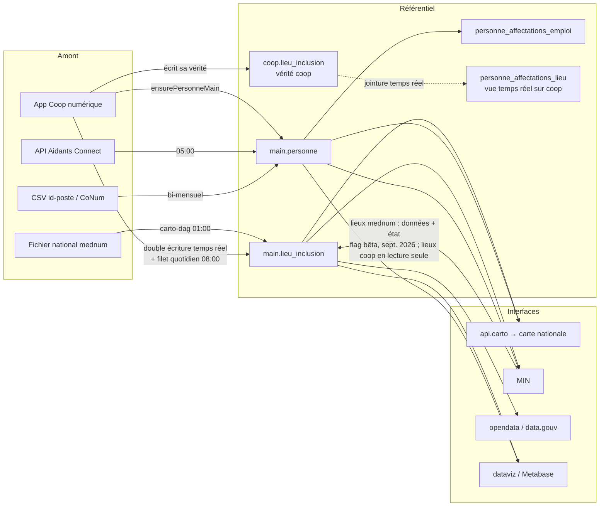

# Cycle de vie des lieux d'inclusion et des personnes

*D'où viennent-ils, pourquoi apparaissent-ils, pourquoi disparaissent-ils.*

> **À qui s'adresse ce document.** À quiconque veut comprendre la logique qui peut
> mettre à jour, faire apparaître ou faire disparaître un lieu d'inclusion ou une
> personne (médiateur, conseiller numérique, aidant, coordinateur) dans nos
> interfaces : cartographie nationale, MIN, opendata, dataviz/Metabase.
> La section 1 suffit pour une vue d'ensemble ; les sections 2 et 3 détaillent ;
> la section 4 liste les pièges connus — c'est souvent là que se trouve la réponse
> à « pourquoi ce lieu/cette personne (n')apparaît (pas) ? ».
>
> Rédigé en septembre 2026, à la clôture du chantier #1724 (refonte du référentiel
> des lieux). Les reliquats connus vivent dans le ticket #1943.
>
> Une version **sans jargon, à destination du support**, existe :
> [`cycle-de-vie-lieux-personnes-support.md`](cycle-de-vie-lieux-personnes-support.md).
> ⚠️ **Les deux documents vivent ensemble** : toute mise à jour ici (nouvelle
> source, nouveau critère de visibilité, changement de délai…) doit être
> répercutée dans la version support, et réciproquement.
> Chaque assertion de ce document est tracée vers sa preuve (test, sonde, ou
> trou assumé) dans la **matrice de preuve** :
> [`cycle-de-vie-lieux-personnes-preuves.md`](cycle-de-vie-lieux-personnes-preuves.md).

---

## 1. Vue d'ensemble

### 1.1. Deux objets, deux tables pivot

| Objet | Table pivot | Type | Propriétaire |
|---|---|---|---|
| Lieu d'inclusion | `main.lieu_inclusion` | **table** (depuis V162/V163, sept. 2026) | dataspace (Flyway) |
| Personne | `main.personne` | table (V004) | dataspace (Flyway) |

Autour de chaque pivot gravitent des tables satellites (adresses, affectations,
contrats, postes) et des vues de consommation (`api.carto`, `min.personne_enrichie`,
`opendata.*`, `dataviz.*`).

**Cas particulier structurant, décidé en sept. 2026 (#1724)** : pour les lieux, la
Coop numérique **garde sa propre vérité** dans `coop.lieu_inclusion` (c'est ce que
son application affiche à ses utilisateurs). `main.lieu_inclusion` est le
**référentiel pour tous les autres consommateurs**. Quand la coop crée ou modifie
un lieu, elle le « dit » au référentiel (double écriture, cf. § 2.3).

### 1.2. Qui écrit quoi

| Écrivain | Lieux | Personnes |
|---|---|---|
| `carto-dag-import` (quotidien, 01:00) | fichier national mednum → lignes non-coop | — |
| `aidants-connect-import` (quotidien, 05:00) | — | upsert depuis l'API Aidants Connect |
| `coop-import` (quotidien, 08:00) | **filet** de réconciliation (§ 2.3) | plus rien depuis août 2026 (#1707) |
| Application coop (temps réel) | **double écriture** vers le référentiel (PR coop #615) | `ensurePersonneMain` + affectations emploi |
| `schema-idPoste` (bi-mensuel) | — | upsert CoNum (personnes, postes, contrats) |
| `personne-reconciliation` (quotidien, 11:00) | — | détection + fusion de doublons |
| `lieu-appariement` (quotidien, 12:00) | appariement lieux coop ↔ mednum (file de revue humaine) | — |
| MIN (temps réel) | **lieux issus de la mednum** (flag bêta-testeur, sept. 2026) : données (`edited_by='min'`, `updated_at_min`, `source='Mon Inclusion Numérique'`), masquage carte, soft delete ; **lieux coop : lecture seule** (renvoi vers la Coop, SEPT #1951) | soft delete lors des fusions de structures |

L'orchestration est décrite dans [`ci-cd-orchestrator.md`](ci-cd-orchestrator.md)
et les flux détaillés par source dans [`flux-globaux.md`](flux-globaux.md).

### 1.3. Le principe d'arbitrage entre sources

Plusieurs écrivains touchent les mêmes lignes. Les règles, actées sur #1724 :

- **Un `updated_at` par source** (`updated_at_carto/coop/min` pour les lieux,
  `updated_at_ac/coop/idposte` pour les personnes). Sur les lieux, `updated_at`
  tout court est une **colonne générée** (`GREATEST` des trois) — personne ne
  l'écrit jamais.
- **En cas de conflit, le plus frais gagne — à dates honnêtes.** Une date de mise
  à jour ne doit refléter qu'un vrai changement (cf. § 4 : la fraîcheur coop a été
  polluée par des bumps de masse).
- **Une valeur bat un vide** (« celui qui sait a raison ») : un NULL venu d'une
  source externe n'écrase jamais une valeur existante.
- **L'état d'un lieu n'est pas une donnée** (SEPT #1950, sept. 2026). Deux
  familles de champs, deux régimes. Les **données** (nom, adresse, horaires,
  services, contact…) suivent l'arbitrage ci-dessus : le plus frais gagne, et
  **aucune source n'est supérieure à une autre** — ni la mednum, ni la Coop, ni
  MIN. L'**état** (`visible_pour_cartographie_nationale`, `deleted_at`) est une
  décision de gestion : il n'appartient qu'aux outils où un humain gère le lieu
  (la Coop pour les médiateurs, MIN pour les gestionnaires). Le fichier national
  est un flux automatique : il ne pilote l'état que des lignes que personne n'a
  jamais gérées (`structure_coop_id IS NULL AND updated_at_min IS NULL` —
  présent au fichier = allumé, absent = éteint et déréférencé) et ne rallume
  jamais un lieu supprimé. Corollaire : une ligne gérée par MIN continue de
  recevoir les **données** du fichier national s'il est plus frais.
  Spécification exécutable : `tests/carto/cas_cycle_de_vie_lieux.yml`.
- **L'effacement humain est respecté** : quand un humain vide un champ, on retire
  *sa* contribution ; les valeurs venues d'autres sources restent et lui sont
  re-proposées (difftool) — **jamais d'arbitrage silencieux**, l'humain tranche.
- **Leçon structurelle** : toute réconciliation gardée *uniquement* par date est
  aveugle (elle rate les changements sans bump et gobe les bumps sans changement).
  Le filet des lieux compare donc **les valeurs**, pas les dates (§ 2.3).

### 1.4. Schéma global des flux



### 1.5. Règle d'or : rien n'est supprimé physiquement — sauf par fusion

Aucun flux *courant* ne fait de `DELETE` sur les pivots. « Disparaître »
signifie presque toujours **ne plus passer un filtre de lecture** :

- lieux : `deleted_at` (soft delete), drapeau `visible_pour_cartographie_nationale`,
  présence/absence d'un `structure_cartographie_nationale_id` ;
- personnes : `deleted_at`/`deleted_by` (soft delete — ⚠️ **pas écrit par MIN
  seulement**, contrairement à ce que ce document a affirmé jusqu'au 22/09/2026 :
  le flux Aidants Connect l'écrit aussi au retrait d'une habilitation, et il
  n'est jamais effacé quand une autre source continue de faire vivre la
  personne. C'est un marqueur **par source** posé sur un pivot partagé, pas un
  état de la personne — il ne vaut pas fin d'activité, cf. § 3.5),
  `est_active` sur les affectations, `is_visible` (choix de confidentialité),
  `date_rupture` des contrats CoNum.

**L'exception : les fusions.** Une fusion supprime physiquement la fiche
perdante, après avoir déplacé ce qu'elle portait vers la gagnante :

- fusion de **lieux côté coop** (`mergeLieuInclusion.ts` : rattachements,
  activités et listes déplacés/fusionnés vers la cible, puis `DELETE` du lieu
  source ; il existe aussi un job d'administration `apply-supprimer-lieux` qui
  supprime des lieux par lot) ;
- fusion de **personnes chez nous** (`personne-reconciliation-dag.py` :
  affectations et postes re-pointés, puis `DELETE FROM main.personne` de la
  ligne perdante, journalisé dans `audit.personne_merge_log`).

Corollaire : pour comprendre une disparition, il faut identifier **quel filtre**
la ligne ne passe plus — et si la ligne n'existe vraiment plus, chercher une
fusion (journaux d'audit côté dataspace).

### 1.6. Ordres de grandeur (mesurés le 17/09/2026, copie de la prod)

**Lieux vivants (`deleted_at IS NULL`) : ~24 300**, par origine :

| Origine | Total | Dont drapeau « visible » |
|---|---|---|
| Pur mednum (fichier national seul) | 11 539 | 11 031 |
| Mixte coop + mednum (appariés) | 7 761 | 7 738 |
| Pur coop (pas encore référencés carto) | 5 007 | 943 |

**Servis par `api.carto` (= visibles sur la carte) : 18 769** = les mednum purs
visibles + les mixtes visibles. Les 943 « purs coop visibles » n'y figurent
**pas** : sans `structure_cartographie_nationale_id`. Pour l'essentiel (~740,
mesuré le 21/09), ce n'est pas un retard de référencement mais la **règle de
publication de la coop** (`lieux-publies.query.ts`) : un lieu n'est transmis à
mednum-cli que s'il est visible, qu'au moins un médiateur visible y exerce
encore et qu'il déclare au moins un service. Le reste tient en une poignée de
cas (adresse incomplète, rejets à l'ingestion) suivis dans #1943. À l'inverse, **23 lieux déclarés par la mednum sont cachés
par le choix coop** (mixtes à drapeau `visible = false`) — ce sont précisément
les 23 du reliquat opendata (§ 4, piège n° 6).

**Personnes** : ~17 070 fiches vivantes, dont ~3 800 avec compte Coop.
~3 840 ont au moins un lieu d'activité.

⚠️ Deux périmètres à ne pas confondre, et c'est une confusion facile :

| | Visibilité **personne** seule<br/>(`personne_visibilite_carto.expose`) | Réellement **servi par `api.carto`**<br/>(+ critères de lieu du § 2.4) |
|---|---|---|
| Personnes | 2 344 | 2 213 |
| Paires personne × lieu | 9 800 | 7 819 |
| Lieux portant ≥ 1 médiateur | 8 323 | 6 486 |

*(mesures du 22/09/2026 après V171 ; au 17/09, colonne de gauche uniquement :
2 342 personnes, 9 781 paires, 8 308 lieux — l'écart de cinq jours est la dérive
normale. La parenthèse V170, qui a brièvement ramené la colonne de droite à
2 059 / 7 245 / 6 078, est annulée : cf. § 3.5.)*

La colonne de gauche ignore les critères de lieu : un médiateur peut y passer
alors que son lieu n'est pas référencé carto, est masqué ou supprimé. Rapportée
aux 18 769 lieux servis, la colonne de droite donne la seule proportion
publiable : **environ un tiers des lieux de la carte affichent au moins un
médiateur** (6 486 / 18 769). Contrôle : `scripts/rapport_exposition_carto.sql`,
ou directement

```sql
SELECT count(*) FILTER (WHERE mediateurs IS NOT NULL),
       sum(jsonb_array_length(mediateurs))
FROM api.carto;
```

---

## 2. Les lieux d'inclusion

### 2.1. Les sources

1. **Cartographie nationale mednum** (`carto-dag-import.py`, 01:00) : importe le
   fichier national, crée/met à jour les lignes **non-coop** et enrichit les
   lignes communes (champ par champ, borné par les règles du § 1.3). Détails :
   [`cartographie-nationale.md`](cartographie-nationale.md) et
   [`api-carto-structures-regles.md`](api-carto-structures-regles.md).
2. **La Coop numérique**, par deux canaux complémentaires :
   - **double écriture applicative** (temps réel, PR coop #615) — le chemin
     nominal, cf. § 2.3 ;
   - **filet quotidien** (`etl/load/registre_lieux_coop.py`, dans le coop-dag) —
     le rattrapage, cf. § 2.3.
3. **MIN** (édition, suppression, visibilité — sous flag bêta-testeur,
   sept. 2026 ; sortie du flag conditionnée à la mise en prod de SEPT #1950) :
   écrit **directement au référentiel** les **lieux issus de la mednum**
   (données avec `edited_by='min'`, `updated_at_min`,
   `source='Mon Inclusion Numérique'` ; état : masquage carte, soft delete).
   Les **lieux coop sont en lecture seule dans MIN** (SEPT #1951) : la Coop
   garde sa vérité et le filet réalignerait toute édition MIN dès le lendemain
   (§ 2.3). Un message renvoie le gestionnaire vers la Coop. Rien n'est écrit
   dans `coop.*` (MIN n'y a que SELECT).
4. **Appariement** (`lieu-appariement-dag.py`, 12:00) : rapproche lieux coop et
   records mednum (`main.lieu_appariement`), avec file de revue humaine
   (`dataviz.lieu_appariements_a_valider`, page MIN dédiée).

### 2.2. Le modèle de vérité (décision #1724, sept. 2026)

- `coop.lieu_inclusion` = **la vérité de la coop, pour son application**.
- `main.lieu_inclusion` = **la vérité pour tous les autres** : api.carto, opendata,
  MIN, dataviz.
- Les deux peuvent diverger **temporairement** ; la vue `main.lieu_divergences_coop`
  (V161/V166) expose une ligne par (lieu coop vivant, champ divergent). Quand un
  utilisateur coop veut modifier un lieu divergent, l'application lui demande
  d'abord de **synchroniser** via un difftool : c'est le garde-fou « l'humain
  tranche ».
- État nominal de la vue divergences : uniquement des lignes `contact.*`
  (héritage du stock combiné depuis l'archive mednum, qui décroît au fil des
  éditions). **Toute divergence hors `contact.*` qui persiste plus de 24 h est une
  anomalie.**

⚠️ Gouvernance : l'application coop se connecte avec le rôle `sonum`,
**propriétaire** des tables `main` — aucun grant PostgreSQL ne la contraint. Sa
protection est son typage applicatif (`ColonnesDuRegistre`). Les grants du rôle
`coop` (V160) documentent le périmètre officiel, prêts pour un futur rôle borné
(reliquat #1943).

### 2.3. Comment un lieu est mis à jour

**Chemin nominal — la double écriture coop** (même transaction Prisma que
l'écriture dans `coop.lieu_inclusion`) :

- *update* si le lien `structure_coop_id` existe, sinon **adoption** d'une
  inscription existante sans lien (anti-doublon : matching par `carto_id` puis
  par identité du lieu), sinon *insert* ;
- écriture **par chemin** (seules les colonnes réellement modifiées), jamais
  toute la ligne ;
- adresse résolue par `main.trouver_ou_creer_adresse_lieu` (V155) ;
- `source = 'Coop numérique'` et `updated_at_coop` posés à chaque écriture ;
- suppression = `deleted_at` (jamais de DELETE).

Contrat détaillé : `contrat_coop_lieux_v2_20260909.md` (racine du repo).

**Filet quotidien** (`etl/load/registre_lieux_coop.py`, coop-dag 08:00) :

- insère les lieux coop vivants qui n'auraient aucune ligne au référentiel
  (invariant : 0 attendu), complète les adresses ;
- recalcule le compteur `mediateurs_en_activite` **par valeurs** ;
- **rattrapage métier par comparaison de valeurs** des ~20 champs (jamais par
  date) : chaque exécution compare référentiel et coop champ à champ et réaligne.
  C'est aussi une **alarme** : `metier_rafraichi > 0` dans les logs signifie
  qu'un chemin d'écriture contourne la double écriture.

Pourquoi par valeurs et pas par date : on a observé les deux pannes symétriques
en prod — un backfill coop sans bump de date (1 672 labels perdus en juillet, cf.
[`analyse-updated-at-lieu-inclusion.md`](analyse-updated-at-lieu-inclusion.md))
et des bumps de masse sans changement (12 086 lieux les 06-07/07/2026). Une garde
par date est aveugle dans les deux sens.

**MIN** écrit les lieux non coop dans `main.lieu_inclusion` en direct (Prisma) :
`edited_by = 'min'`, `updated_at_min` à chaque écriture, `source = 'Mon Inclusion
Numérique'` sur les écritures de **données** seulement (jamais sur une
suppression ni un changement de visibilité — même règle que la signature coop).
`source` nomme le dernier producteur des données affichées, pas un propriétaire :
le fichier national la réécrit s'il repasse plus frais.

**Conventions à connaître** :

- *Listes vides* : `{}` et `NULL` sont **équivalents** (V166). Prisma ne peut pas
  écrire NULL dans une liste scalaire → la coop pose `[]`, l'historique porte
  NULL ; tous les comparateurs normalisent les deux côtés.
- *Contact* : JSONB combiné clé par clé (`telephone`, `courriels`, `site_web`) —
  la coop gagne, mais une clé issue de l'archive mednum survit là où la coop n'a
  rien (dernière trace d'enrichissements éteints par la règle des 6 mois).
- *Fraîcheur mednum* : le fichier national **n'expire pas** les vieux lieux ; la
  seule règle temporelle est `mergeOldLieux` (contribution d'un doublon de plus
  de ~6 mois éteinte à la fusion). La `date_maj` d'un record commun reflète la
  modification coop — fraîcheur dégénérée, documentée dans le docstring de
  `carto-dag-import.py`.

### 2.4. Apparition / disparition, interface par interface

| Interface | Un lieu s'affiche si… |
|---|---|
| **Carte nationale** (`api.carto`) | `structure_cartographie_nationale_id IS NOT NULL` **ET** `visible_pour_cartographie_nationale = true` **ET** `deleted_at IS NULL` (toutes origines depuis V167) |
| **MIN** | lecture directe de `main.lieu_inclusion` (les lieux supprimés sont filtrés applicativement) |
| **Opendata / data.gouv** | filtre V145 : `carto_id` **OU** `visible` — ⚠️ connu : 23 lieux masqués encore publiés (reliquat #1943) |
| **App coop** | sa propre table `coop.lieu_inclusion` — le référentiel n'y est pour rien |
| **Publication coop → fichier national** (`lieux-publies.query.ts`) | `visible_pour_cartographie_nationale` **ET** au moins un médiateur visible en activité **ET** au moins un service — sinon le lieu n'atteint jamais mednum-cli, donc jamais `api.carto` |

**Délai d'affichage sur la carte** : le site de la carte nationale garde sa
propre copie des données lues sur `api.carto` et la recharge par cycles (hard
refresh déclenché par le carto-dag) — une modification déjà visible dans
l'entrepôt peut mettre **jusqu'à ~5 h** à apparaître sur la carte. Piste
d'amélioration identifiée (sept. 2026, non instruite) : déclencher ce refresh
depuis la coop ou MIN après une écriture, pour ramener le délai à quelques
minutes.

**Pour un lieu géré par un outil** (coop : `structure_coop_id` ; MIN :
`updated_at_min`), la visibilité carte = son drapeau
`visible_pour_cartographie_nationale`, décision du médiateur ou du
gestionnaire ; le `carto_id` est conservé même masqué. Le cycle de vie
automatique du carto-dag (déréférencement nocturne quand un record disparaît
du fichier national, réactivation quand il revient) est **restreint aux lignes
externes** (`structure_coop_id IS NULL AND updated_at_min IS NULL`,
`etl/load/carto_integration_lieux.py`) et ne rallume jamais un lieu supprimé :
le fichier national ne peut ni éteindre ni rallumer un lieu qu'un humain gère.
Un lieu créé dans MIN sans `carto_id` est conservé tel quel mais n'apparaît pas
sur la carte tant qu'aucun référencement ne lui pose un `carto_id` (#1495).

### 2.5. Sondes et contrôles

- `main.lieu_divergences_coop` : hors `contact.*` et plus vieux que 24 h = anomalie.
- Logs du filet : `metier_rafraichi = 0` et `reste_sans_registre = 0` attendus ;
  `orphelins_retires = 0` attendu (> 0 = un lieu coop supprimé physiquement
  sans écho, warning dans les logs) ; contrôle de santé §7 = 0 ligne.
- Spécifications exécutables sur base (`DATABASE_URL=… pytest tests/carto
  tests/coop`) : `tests/carto/cas_cycle_de_vie_lieux.yml` (cycle de vie carto,
  14 cas, exécute le SQL réel de la tâche) et
  `tests/coop/test_filet_registre_lieux.py` (filet entier, orphelins).
- Script rejouable : `controle_sante_lieux_temporaire_20260915.sql` (racine du repo,
  `psql $PROD_URL -f …`) — 6 sections, lecture seule.

---

## 3. Les personnes

### 3.1. Les sources

1. **id-poste / CoNum** (`schema-idPoste.py`, bi-mensuel, CSV sur S3) : personnes,
   postes, contrats, subventions. Détails :
   [`conseillers-numeriques.md`](conseillers-numeriques.md) et
   [`id-poste-regles.md`](id-poste-regles.md).
2. **Aidants Connect** (`aidants-connect-dag.py`, 05:00, API) : aidants et
   organisations. Détails : [`aidants-connect.md`](aidants-connect.md).
3. **La Coop** : depuis août 2026 (#1707, ADR-002), **le coop-dag n'écrit plus les
   personnes** ; c'est l'application coop qui écrit directement `main.personne`
   et `main.personne_affectations_emploi` (`ensurePersonneMain.ts`,
   `ensureAffectationEmploiMain.ts`), avec rapprochement par email quand le
   `coop_id` n'est pas encore posé.
4. **Réconciliation** (`personne-reconciliation-dag.py`, 11:00) : photo quotidienne
   des doublons intra-source (non fusionnables) + **fusion automatique** des
   doublons complémentaires sous gardes strictes (même nom+prénom normalisés,
   affectation active sur la même structure des deux côtés, aucun chevauchement
   d'identifiants, paire non ambiguë), journalisée dans `audit.personne_merge_log`.

### 3.2. Le modèle

`main.personne` porte **un identifiant unique par système amont** — `coop_id`,
`cn_pg_id`, `conseiller_numerique_id`, `aidant_connect_id` — c'est le cœur du
rapprochement inter-sources. S'y ajoutent :

- les drapeaux de rôle (`is_mediateur`, `is_coordinateur`, `is_referent_ac`, …) ;
- un `updated_at` **par source** (`updated_at_ac`, `updated_at_coop`,
  `updated_at_idposte`) pour l'arbitrage de fraîcheur ;
- `is_visible` (choix de confidentialité, V062) ;
- `deleted_at` / `deleted_by` (soft delete, V033).

Le cycle de vie n'est **pas** porté par `main.personne` mais par ses satellites :
`personne_affectations_emploi` (personne ↔ structure administrative, avec
`est_active` par source), `personne_affectations_lieu` (personne ↔ lieu, cf.
§ 3.6), `main.contrat` (CoNum : `date_debut`, `date_fin`, `date_rupture`),
`main.poste`.

### 3.3. Politiques de mise à jour, par source

| Source | Politique |
|---|---|
| Aidants Connect | update conditionnel par fraîcheur (`WHERE updated_at_ac` amont > local), insert `ON CONFLICT DO NOTHING` pour les nouveaux |
| id-poste | « ne pas écraser » : `COALESCE(valeur locale, valeur import)` + fusion JSONB du contact ; postes/contrats en `ON CONFLICT DO NOTHING` |
| Coop | garantie d'existence au moment du besoin (« la coop n'assure PAS une synchro continue de main.personne ») |
| Fusions | uniquement le DAG réconciliation (auto, gardé) et MIN (fusions de structures) |

### 3.4. Les trois notions d'« activité » (⚠️ non alignées)

1. **Emploi** : `personne_affectations_emploi.est_active`, par source —
   recalculée pour `idposte` à chaque import **depuis les contrats**
   (`date_rupture IS NULL`) ; posée par l'API pour `aidants-connect` ; posée par
   l'application pour `coop`.
2. **Présence en lieu** : `personne_affectations_lieu.est_active` — vue **temps
   réel** sur `coop.mediateurs_en_activite` (période non supprimée, fin nulle ou
   future).
3. **Contrat CoNum** : `main.contrat.date_rupture`.

Seule la 3ᵉ alimente mécaniquement la 1ʳᵉ, et seulement pour la source
`idposte`. Une source ne peut pas éteindre l'affectation posée par une autre —
d'où le manque connu : **un CN à contrat rompu reste « actif » (et visible sur la
carte) tant que la coop ne clôt pas son emploi** (~230 personnes mesurées en
sept. 2026).

### 3.5. Apparition / disparition, interface par interface

**Carte nationale** — règle formalisée dans la vue
`main.personne_visibilite_carto` (V165), une ligne par (personne, lieu), avec un
`motif_exclusion` lisible :

```
expose = lieu_actif  ET  compte_coop_actif  ET  visible_coop  ET  emploi_autorise
```

| Critère | Signification |
|---|---|
| `lieu_actif` | au moins une période `coop.mediateurs_en_activite` en cours sur ce lieu |
| `compte_coop_actif` | `coop.users.deleted IS NULL` |
| `visible_coop` | la personne n'a pas choisi d'être masquée (`coop.mediateurs.is_visible`) |
| `emploi_autorise` | aidant AC, **ou** CN *avec* emploi actif hors AC, **ou** ni CN ni AC (déclaratif) |

⚠️ **`main.personne.deleted_at` ne figure pas dans cette liste, et c'est
délibéré.** V170 l'y avait ajouté le 22/09/2026 (critère `personne_active`), par
analogie avec la doctrine V167 sur les lieux ; V171 l'a retiré le jour même,
après mesure. L'analogie ne tient pas : `deleted_at` est écrit **par une
source** — le flux Aidants Connect au retrait d'une habilitation, MIN par
ailleurs — et n'est jamais effacé quand une autre source continue de faire vivre
la personne. Sur les 154 personnes que V170 retirait de la carte :

| | |
|---|---:|
| emploi actif hors `aidants-connect` | 154 / 154 |
| contrat CoNum non rompu | 129 / 154 |
| mise à jour coop **postérieure** au `deleted_at` | 154 / 154 |
| `deleted_by` = `{aidants-connect}` seul | 144 / 154 |

Cas témoin, personne 1549 : `deleted_at` posé le 27/10/2022 par
`aidants-connect`, affectations `coop` et `idposte` actives, compte coop vivant
et visible, contrat CoNum 2023-09-26 → 2026-09-25 sans rupture. Conseillère
numérique en poste, que V170 retirait de la carte.

La colonne `personne_active` subsiste dans la vue (on ne retire pas une colonne
par `CREATE OR REPLACE`), **informative uniquement** : son commentaire SQL le
dit. Exclure les personnes réellement parties reste un besoin ouvert, mais
demande un signal fiable — absence d'emploi actif toutes sources confondues — et
un arbitrage métier ; encodé en `manque` dans la spec
(`manque_personne_reellement_partie`).

S'y ajoutent les critères côté lieu (§ 2.4). Conséquence structurelle : **la
carte n'affiche que des personnes ayant un compte Coop** — `lieu_actif` passe
par `coop.mediateurs_en_activite` joint sur le `coop_id` (§ 3.6) ; le critère
`compte_coop_actif` couvre, lui, le compte qui a existé puis a été supprimé.
Téléphone et `is_visible` sont lus **en direct dans le schéma coop** (pas de
lag).

L'**adresse publiée** vaut `COALESCE(coop.users.email,
contact->'idposte'->>'mail_pro')` : champs professionnels uniquement. Le repli
sur `contact->'idposte'->>'mail_perso'` a été retiré par V170 — même règle que
côté MIN pour la fiche aidant. Garde plus que correction : une personne publiée
ayant par construction un compte Coop dont l'adresse est renseignée, ce repli
n'était atteint par aucune ligne publiée à la mesure du 2026-09-22. Attention en
revanche : une même adresse peut être enregistrée **des deux côtés** (Coop et
`mail_perso`), auquel cas elle reste publiée — le filtre porte sur le champ
d'origine, pas sur la valeur.

Spécification exécutable : `tests/carto/cas_visibilite.yml` ; contrôle du
périmètre servi : `scripts/rapport_exposition_carto.sql` ; vulgarisation et
manques connus : `visibilite_api_carto_20260914.md` (racine du repo).

**MIN** — tout passe par la vue `min.personne_enrichie` (V092), jamais
`main.personne` en direct :

- listes et compteurs : `est_actuellement_mediateur_en_poste` **OU**
  `est_actuellement_aidant_numerique_en_poste` ;
- « en activité » = au moins une affectation emploi `est_active` ; le filtre UI
  « anciens » est le seul moyen de voir les sortants ;
- `est_actuellement_conseiller_numerique` = affectation `idposte` active, donc
  **piloté par `date_rupture`** ;
- ⚠️ ni la vue ni les loaders ne filtrent `deleted_at` : une personne
  soft-deletée avec une affectation encore active **reste listée** (seul le
  loader des doublons filtre).

**Dataviz / Metabase** — `dataviz.personne` et `dataviz.poste` n'ont **aucun
`WHERE`** : tout le stock est exposé, personnes supprimées comprises. Le tri se
fait par les colonnes calculées (« En poste », « Aidants Connect », …).

### 3.6. Le lien personne ↔ lieu ↔ structure

- **personne ↔ structure** : `main.personne_affectations_emploi`, table physique,
  trois écrivains distingués par `source` (`idposte`, `aidants-connect`, `coop`),
  upsert idempotent, jamais de DELETE.
- **personne ↔ lieu** : `main.personne_affectations_lieu` est une **VUE temps
  réel** sur la coop depuis V151 (l'ancienne réplique quotidienne créait un jour
  de lag et des liens morts) :
  `coop.mediateurs_en_activite → coop.mediateurs → main.personne (par coop_id)`
  et `→ main.lieu_inclusion (par structure_coop_id)`.
- Conséquence directe : **une personne sans `coop_id` n'a aucun lieu, donc
  n'apparaît jamais sur la carte** — quel que soit son statut CN ou AC.
- **lieu ↔ structure** : il n'existe **plus de lien direct** (le compteur
  `emplois` des lignes coop est NULL depuis V158 ; l'association lieu ↔ SA est
  une projection « lâche » de `structure_coop_id`, cf. #1711). La chaîne passe
  obligatoirement par la personne.

### 3.7. Les coordonnées des personnes (nom, email, téléphone)

**Où elles sont stockées.** `main.personne` porte le nom/prénom et un JSONB
`contact` organisé **par source** : `contact->'coop'` (email, téléphone du
compte Coop), `contact->'idposte'` (`mail_pro`, `mail_perso`, `telephone` du
dossier CoNum), etc. Ce sont les données personnelles à protéger (cf.
mémoire/doctrine : les données SIRENE sont publiques, les contacts des
médiateurs ne le sont pas).

⚠️ **Depuis V164, `contact->'coop'` et `main.personne.is_visible` sont des
copies GELÉES** : plus personne ne les écrit. La vérité vivante est dans le
schéma coop (`coop.users.email`, `coop.users.phone`, `coop.mediateurs.is_visible`).

**Qui affiche quoi, et depuis où :**

| Interface | Nom | Email / téléphone | Condition d'affichage |
|---|---|---|---|
| **Carte** (`api.carto`) | `main.personne` (prenom/nom) | **en direct** : `coop.users.email` / `coop.users.phone` (normalisé E.164 par `main.normaliser_telephone`), **repli** `contact->'idposte'` (`mail_pro` puis `mail_perso` / `telephone`) | seulement si la personne est exposée (§ 3.5) — donc jamais si elle s'est masquée |
| **MIN** (fiche médiateur) | `min.personne_enrichie` | le JSONB `contact` — **dont la clé `coop` gelée** (V164) : risque de coordonnées périmées | accès restreint gestionnaires |
| **dataviz/Metabase** | `dataviz.personne` (en clair) | `contact->'coop'` (gelé) + mails idposte ; variantes `*_pseudonymisee` pour les accès larges | interne uniquement |
| **Opendata** | — | **aucune coordonnée personnelle** : seuls les contacts *du lieu* (`lieu_inclusion.contact`) sont publiés | — |

À bien distinguer : le **contact du lieu** (`main.lieu_inclusion.contact` —
téléphone/courriels/site web de la structure, donnée professionnelle publique,
cf. § 2.3) et le **contact de la personne** (ci-dessus). Sur la carte, la fiche
d'un lieu montre les deux : le contact du lieu, et la liste de ses médiateurs
exposés avec leurs coordonnées.

**Conséquence pratique** : pour corriger un email/téléphone affiché sur la
carte, la personne modifie **son compte Coop** (effet au prochain
rafraîchissement de la carte, ~5 h). Une coordonnée fausse dans MIN ou Metabase
peut en revanche venir de la copie gelée ou du dossier CoNum d'époque — cf.
piège n° 9.

---

## 4. Pièges et dettes connus

1. **Aucun flux ne désactive une personne disparue d'un export amont.** Tous les
   écrivains sont en upsert ; la disparition amont est silencieuse (la ligne et
   ses affectations restent en l'état).
2. **CN à contrat rompu encore visibles** (~230) : l'affectation `coop` reste
   active tant que la coop ne la clôt pas (§ 3.4). Les « autres médiateurs »
   (déclaratifs) n'ont, eux, aucun contrôle d'activité.
3. **`deleted_at` personne ignoré** par `min.personne_enrichie` et
   `dataviz.personne` (§ 3.5).
4. **Grants `sonum` sur `main.personne` posés à la main en base, hors Flyway**
   (cf. `ensurePersonneMain.ts` côté coop) — non reproductibles sur un
   environnement neuf. Même sujet de gouvernance que le rôle `sonum`
   propriétaire côté lieux (§ 2.2) — reliquat #1943.
5. **Fraîcheur coop polluée** : 12 086/12 708 lieux « bumpés » les 06-07/07/2026
   sans changement réel. Toute logique fondée sur `updated_at_coop` antérieur à
   cette date est suspecte ; préalable au canal carto → référentiel arbitré
   (#1943).
6. **Opendata : 23 lieux masqués encore publiés** (filtre V145 à aligner, #1943).
7. **Listes vides** : toujours comparer avec la convention `{} ≡ NULL` (V166) —
   une comparaison naïve fabrique de fausses divergences.
8. **Suppression physique côté coop sans écho au référentiel** (instruit le
   18/09/2026, SEPT #1950). La fusion manuelle coop écrit désormais l'écho
   (`retirerDuRegistre` → `deleted_at`, coop 11/09). Les 5 orphelins constatés
   (ids 15686, 194973, 3487, 229407, 63124) venaient du job coop
   `update-structures-cartographie-nationale` (run du 11/09, retiré du code le
   09/09) qui fusionnait les composites coop↔coop de mednum-cli sans rien dire
   au registre. Il n'y a toujours pas de FK inter-schémas : le **filet balaie
   désormais les orphelins** (`SQL_RETIRER_ORPHELINS` : `deleted_at` posé,
   identité conservée, compteur `orphelins_retires`, warning) et le contrôle de
   santé §7 doit rester à 0.
9. **`contact->'coop'` et `is_visible` de `main.personne` sont gelés depuis
   V164** (la vérité vivante est dans le schéma coop), mais la fiche médiateur
   MIN et `dataviz.personne` les lisent encore : coordonnées potentiellement
   périmées dans ces écrans alors que la carte, elle, lit le direct. À aligner.
10. **Un changement d'état dans MIN retarde les données carto sur ce lieu** :
    la garde de fraîcheur de la branche données lit `updated_at` global
    (GREATEST des trois), que MIN bump aussi sur un masquage ou une suppression.
    Le fichier national ne réécrit alors les données qu'avec une `date_maj`
    postérieure à ce geste. Pratiquement inerte (le DAG tourne chaque nuit, les
    données antérieures étaient déjà appliquées) ; la correction propre serait
    une fraîcheur dédiée à l'état. Documenté, non corrigé (SEPT #1950).

---

## 5. Index des références

**Migrations clés (lieux)** : V153 (vue d'union), V155 (`trouver_ou_creer_adresse_lieu`),
V160 (grants + re-matérialisation du stock coop), V161/V166 (vue divergences,
équivalence listes vides), V162 (bascule vue → table), V163 (renommage
`lieu_inclusion_registre` → `lieu_inclusion`), V145 (filtre opendata), V158
(`emplois` NULL), V167 (`api.carto` : `deleted_at` filtré pour toutes les
origines).

**Migrations clés (personnes)** : V004 (schéma), V033 (soft delete), V062
(confidentialité), V064 (`updated_at` par source), V071/V072 (affectations),
V092 (`min.personne_enrichie`), V151 (affectations lieu en vue temps réel),
V165 (`personne_visibilite_carto`).

**Docs métier existantes** (ce document les référence, il ne les remplace pas) :
[`flux-globaux.md`](flux-globaux.md) ·
[`cartographie-nationale-metier.md`](cartographie-nationale-metier.md) ·
[`coop-metier.md`](coop-metier.md) ·
[`aidants-connect-metier.md`](aidants-connect-metier.md) ·
[`conseillers-numeriques-metier.md`](conseillers-numeriques-metier.md) ·
[`regles-survivance.md`](regles-survivance.md) ·
[`api-carto-structures-regles.md`](api-carto-structures-regles.md) ·
[`id-poste-regles.md`](id-poste-regles.md)

**Racine du repo** : `visibilite_api_carto_20260914.md` (visibilité carto
vulgarisée + manques), `contrat_coop_lieux_v2_20260909.md` (contrat de la double
écriture), `controle_sante_lieux_temporaire_20260915.sql` (contrôle prod rejouable).

**Tests exécutables** : `tests/carto/cas_visibilite.yml` +
`tests/carto/test_visibilite_api_carto.py` (spécification vivante de la
visibilité carto), `tests/carto/cas_cycle_de_vie_lieux.yml` +
`tests/carto/test_cycle_de_vie_lieux.py` (cycle de vie d'un lieu au passage du
carto-dag — exécute le SQL réel de `etl/load/carto_integration_lieux.py`),
`tests/coop/test_filet_registre_lieux.py` (filet entier sur base, orphelins),
`tests-unitaires/coop/test_registre_lieux_coop.py` (ordre et bilan du filet).
