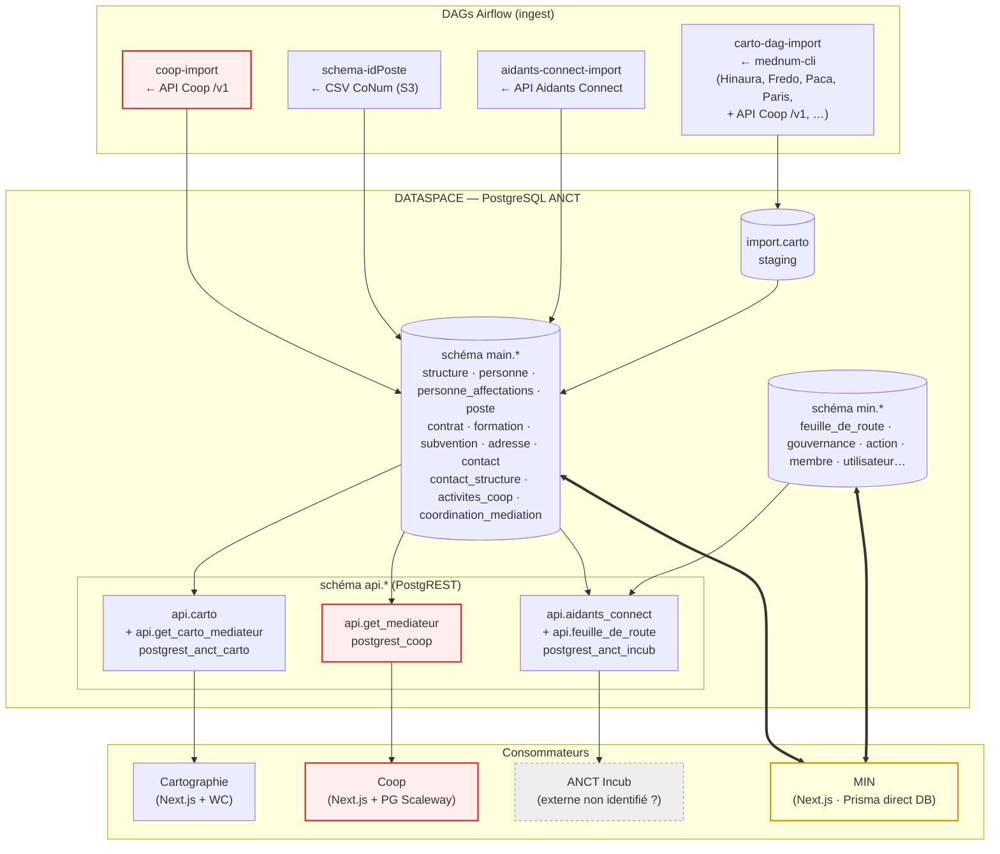
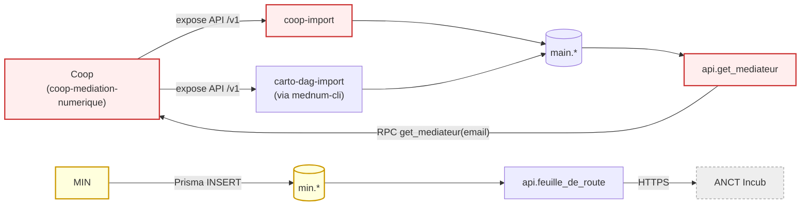

# Flux globaux autour du dataspace

> Vue d'ensemble des **producteurs**, **consommateurs** et **circulations** de
> données autour de la base PostgreSQL du dataspace. Complète les 4 docs
> sources (`coop.md`, `conseillers-numeriques.md`, `aidants-connect.md`,
> `cartographie-nationale.md`) qui décrivent chaque DAG individuellement, mais
> pas les interactions cross-composants ni les accès **hors-DAG**.
>
> ⚠️ **V157 (2026-08-28, #1707)** : `api.get_mediateur` et `main.coordination_mediation`
> n'existent plus (la Coop a retiré son client le 2026-08-20 et lit `main` en direct).
> Les passages ci-dessous qui les mentionnent — boucle §5 incluse — sont historiques.
>
> **À lire en priorité si** : tu touches `api.*` (PostgREST), tu modifies une
> table `main.*` côté MIN, ou tu cherches à comprendre pourquoi une donnée
> remonte / disparaît entre runs.

## 1. Topologie

### Vue principale : pipeline ingest → DB → expose → consommateurs

### Boucles producteur ⇄ consommateur

Coop est à la fois consommateur (via `api.get_mediateur`) **et** source principale
de deux DAGs ingest. MIN est à la fois consommateur direct du schéma `main.*`
**et** producteur du schéma `min.*` réexposé via `api.feuille_de_route`.

Trois grands modes d'accès :

1. **Ingest par DAG Airflow** (4 sources) → écrit dans `main.*` avec marqueur
   `edited_by ∈ {coop,id-poste,aidants-connect,carto}` et timestamps par source
   (`updated_at_coop`, `updated_at_idposte`, `updated_at_ac`, `last_sirene_enrich_at`).
   Couvert exhaustivement par les 4 docs sources existantes.

2. **Lecture via PostgREST** (`api.*`) — modèle pull HTTPS Bearer. Chaque
   vue / RPC est exposée à un rôle dédié :

   | Endpoint | Rôle | Consommateur identifié |
   |---|---|---|
   | `api.carto`, `api.get_carto_mediateur` | `postgrest_anct_carto` | **Cartographie** (`cartographie/`) |
   | `api.get_mediateur` (RPC) | `postgrest_coop` | **Coop** (`coop-mediation-numerique/`) — déclenche en cascade des écritures côté Coop qui repartiront vers `coop-import`, voir §5 |
   | `api.aidants_connect`, `api.feuille_de_route` | `postgrest_anct_incub` | "Incubateur ANCT" — **consommateur externe non identifié dans les 3 repos scannés**. La vue `api.feuille_de_route` agrège côté entrepôt la donnée écrite par MIN dans `min.feuille_de_route`. Plausiblement consommé par un dashboard / un site ANCT, mais à confirmer côté ops |
   | `api.structures` | `postgrest_anct_dev` | Rôle "ANCT role for dev tests" (cf V007), pas un consommateur de production |

3. **Accès direct DB par Prisma** — **MIN uniquement** (`min/`). Prisma ouvre
   la connexion PostgreSQL sur la base entrepôt et a accès aux schémas
   `main`, `admin`, `min`, `reference`. Lecture **ET écriture** côté `main.*`.
   Côté `min.*` (schéma propre à MIN : `feuille_de_route`, `gouvernance`,
   `action`, `membre`, `utilisateur`…) MIN est seul écrivain ; le dataspace
   réutilise ces tables comme source amont pour `api.feuille_de_route`.

## 2. Producteurs documentés (DAGs)

Récapitulatif rapide — détails dans les docs source dédiées.

| DAG | Source amont | Tables écrites `main.*` | Marqueur |
|---|---|---|---|
| `coop-import` | API REST `coop-numerique.anct.gouv.fr/api/v1/` | `structure`, `personne`, `personne_affectations`, ~~`coordination_mediation`~~ (supprimée V157) (`activites_coop` : vue sur `coop.activites` depuis V144, plus d'écriture ETL) | `edited_by='coop'`, `source='coop'` (affectations) |
| `schema-idPoste` | CSV CoNum (S3 `IDPOSTE_S3_BUCKET`) | `structure`, `personne`, `personne_affectations`, `poste`, `contrat`, `formation`, `subvention`, `contact`, `contact_structure` | `edited_by='id-poste'`, `source='idposte'` |
| `aidants-connect-import` | API `aidantsconnect.beta.gouv.fr/api/.../fne_*` | `structure`, `personne`, `personne_affectations` | `edited_by='aidants-connect'`, `source='aidants-connect'` |
| `carto-dag-import` | clone GitHub `mednum-cli` (Hinaura, Fredo, Paca, Paris…) | `import.carto`, `structure`, `adresse` | `edited_by='carto'`, `source=<origine mednum>` |

Triggers aval communs : `structures-similarities-merge`, `personne-similarities-merge`.

## 3. Consommateurs

### 3.1. Cartographie nationale (`cartographie/`)

**Stack** : Next.js + Web Component Vite. Pas de DB propre.
**Config** : `INCLUSION_NUMERIQUE_API_URL=https://api.inclusion-numerique.anct.gouv.fr`,
token Bearer `INCLUSION_NUMERIQUE_API_TOKEN` (rôle PostgREST `postgrest_anct_carto`).

Deux endpoints consommés (cf
`cartographie/src/libraries/inclusion-numerique-api/routes/`) :

| Endpoint | Source SQL | Migration de référence |
|---|---|---|
| `GET /carto` | `VIEW api.carto` | V061 (filtre lieux actifs), V063 (filtre emploi non-AC), **V065** (élargissement contacts médiateurs : COALESCE coop→idposte, ajout branche AC, branche "médiateur non labellisé") |
| `GET /rpc/get_carto_mediateur?name=…` | `FUNCTION api.get_carto_mediateur(text)` | V063 |

Filtres injectés côté SQL : `est_active = true`, `type = 'lieu_activite'`,
`is_visible IS DISTINCT FROM FALSE`, `visible_pour_cartographie_nationale = TRUE`,
`structure_cartographie_nationale_id IS NOT NULL`, présence d'un
`structure_emploi` non-AC actif.

→ Consommation pure. Pas de boucle. Sensible aux choix d'agrégation des
contacts faits dans la vue `api.carto`.

### 3.2. Coop (`coop-mediation-numerique/`)

**Stack** : Next.js + PostgreSQL Scaleway (DB propre, schéma Prisma autonome —
`User`, `Mediateur`, `Structure`, `Activite`…). Aucune connexion DB directe au
dataspace.

**Produit** (vers le dataspace, ingéré par `coop-import`) :
- `/api/v1/structures`
- `/api/v1/utilisateurs` (avec `emplois` et `lieu_activite` inline)
- `/api/v1/activites?since=…`

**Consomme** : `GET /rpc/get_mediateur?email=…` (rôle `postgrest_coop`),
appelé depuis 3 endroits (cf
`apps/web/src/external-apis/dataspace/dataspaceApiClient.ts`) :

| Déclencheur | Fichier |
|---|---|
| Premier login d'un médiateur | `features/inscription/use-cases/initialize/initializeInscription.ts` |
| Bouton admin "Mettre à jour depuis le dataspace" | `features/utilisateurs/use-cases/update-from-dataspace/updateUserFromDataspaceData.ts` |
| Affichage admin utilisateur / emplois | `app/administration/utilisateurs/[id]/(AdministrationUserPage\|emplois/page).tsx` |

Le payload `DataspaceMediateur` retourné contient : `is_coordinateur`,
`is_conseiller_numerique`, `structures_employeuses` (avec contrats), `lieux_activite`,
`conseillers_numeriques_coordonnes` — donnée déjà **agrégée cross-source** par le
dataspace.

**Autres sources externes** (hors dataspace) : MongoDB Conseiller Numérique V1
(legacy), API BAN, API Brevo, ProConnect (auth).

→ **Boucle Coop ↔ dataspace** — voir §5.

### 3.3. MIN (`min/`)

**Stack** : Next.js 15 + Prisma. `DATABASE_URL` pointe directement sur la base
entrepôt. Prisma déclare 4 schémas : `min` (privé), `main` (entrepôt),
`admin` (référentiel territorial), `reference` (NAF, catégories juridiques).

#### 3.3.1. Lectures `main.*`

| Gateway | Tables `main.*` lues |
|---|---|
| `PrismaUneStructureLoader` | `structure`, `contact_structure`, `contact` |
| `PrismaLieuxInclusionNumeriqueLoader`, `PrismaRecupererLieuDetailsLoader` | `structure` + jointures |
| `PrismaTerritoireLoader` | `structure` (groupement département) |
| `PrismaPosteConseillerNumeriqueDetailLoader` | `contact_structure`, vue `min.postes_conseiller_numerique_synthese` (= JOIN sur `main.poste`, `main.contrat`, `main.subvention`, `main.structure`, `main.adresse`) |
| `PrismaContactReferentFneLoader` | `contact_structure` (filtre `est_referent_fne`) |
| `aidantsMedIateurs/PrismaAccompagnementsEtMediateursLoader`, `PrismaNiveauDeFormationLoader` | `structure`, `formation`, vue `min.personne_enrichie` (= `main.personne` ⋈ `main.personne_affectations`) |
| `tableauDeBord/PrismaMediateursEtAidantsLoader` | `structure`, vue `min.personne_enrichie` |
| `PrismaMediateursCoopLoader`, `PrismaStructuresEmployeuesesCoopLoader`, `PrismaCommunesCoopLoader` | `personne_affectations` + JOIN structure |

**Vues d'abstraction côté MIN** :
- `min.personne_enrichie` (migration 2025-08-28) : wrapper sur `main.personne` qui calcule `type_accompagnateur`, `labellisation_aidant_connect`, `est_actuellement_mediateur_en_poste`, `est_actuellement_conseiller_numerique`, `est_actuellement_coordo_actif` à partir de `main.personne_affectations` (filtre `est_active=TRUE`, `type='structure_emploi'`, `source IN ('idposte','coop','aidants-connect')`).
- `min.postes_conseiller_numerique_synthese` (migration 2026-01-07) : agrège `main.poste`, `main.contrat`, `main.subvention` (V1 DGCL + V2 DITP/DGE + bonifications QPV) en une vue par `(poste_conum_id, structure_id)`. Cf `min/docs/postes-conseiller-numerique.md`.

→ Ces deux vues **vivent côté schéma `min` mais sont définies sur des tables
`main`**. Toute évolution structurelle des tables sources (ex. ajout d'une
nouvelle valeur `source` dans `personne_affectations`, ou nouvelle migration
sur `main.poste`/`main.subvention`) doit être **propagée** dans les
migrations Prisma de MIN.

#### 3.3.2. Écritures `main.*` — détail exhaustif

Deux gateways orchestrent l'ensemble des écritures de MIN sur le schéma `main`.

##### 3.3.2.1. `PrismaStructureRepository`

Fichier : `min/src/gateways/PrismaStructureRepository.ts`

| Méthode | Op SQL | Tables / colonnes touchées | Use-case appelant | Server action |
|---|---|---|---|---|
| `create` (transaction) | INSERT `main.adresse` + INSERT `main.structure` | `adresse.*` (clef_interop, code_ban, code_insee, code_postal, nom_commune, nom_voie, numero_voie, repetition, geom — via `$queryRaw` SQL pour le `PostGIS ST_Point`) ; `structure(adresse_id, categorie_juridique, nom, siret, **source='min'**, typologies)` | `AjouterUnMembre` | `ajouterUnMembreAction` |
| `ajouterContact` | INSERT `main.contact` + INSERT `main.contact_structure` | `contact(email, est_referent_fne, fonction, nom, prenom, telephone)`, `contact_structure(contact_id, structure_id)` | direct via gateway (pas de use-case dédié) | `ajouterContactStructureAction` |
| `modifierContact` | UPDATE `main.contact` | mêmes 6 colonnes | direct via gateway | `modifierContactStructureAction` |
| `supprimerContact` | DELETE `main.contact_structure` (deleteMany) + DELETE `main.contact` | — | direct via gateway | `supprimerContactStructureAction` |
| `updateContactReferent` | UPDATE `main.structure` | `structure.contact` (JSONB) → écrit `{courriels: <email>, fonction, nom, prenom, telephone}` | `ModifierContactReferentStructure` | `modifierContactReferentStructureAction` |
| `getBySiret`, `getBySiretEmployeuse` | SELECT only | — | `AjouterUnMembre` (vérif unicité) | — |

⚠️ **`updateContactReferent` écrit dans `main.structure.contact` (JSONB
déprécié depuis V047)** — la table normalisée `main.contact` +
`main.contact_structure` existe pourtant et est utilisée par `ajouterContact`.
Doublon de modèle. Voir §6 point 4.

##### 3.3.2.2. `PrismaLieuInclusionRepository`

Fichier : `min/src/gateways/PrismaLieuInclusionRepository.ts`

| Méthode | Colonnes `main.structure` updatées | Use-case | Server action |
|---|---|---|---|
| `updateDescription` | `presentation_resume`, `presentation_detail`, `typologies`, `horaires`, `prise_rdv`, `itinerance`, `contact.site_web` (JSONB merge) | `ModifierLieuInclusionDescription` | `modifierLieuInclusionDescriptionAction`, `modifierLieuInclusionInformationsPratiquesAction` |
| `updateServicesModalite` | `modalites_acces`, `frais_a_charge`, `contact.telephone`, `contact.courriels.contact_public` (JSONB merge) | `ModifierLieuInclusionServicesModalite` | `modifierLieuInclusionServicesModaliteAction` |
| `updateServicesTypeAccompagnement` | `services`, `modalites_acces`, `modalites_accompagnement` | `ModifierLieuInclusionServicesTypeAccompagnement` | `modifierLieuInclusionServicesTypeAccompagnementAction` |
| `updateServicesTypePublic` | `publics_specifiquement_adresses`, `prise_en_charge_specifique` | `ModifierLieuInclusionServicesTypePublic` | `modifierLieuInclusionServicesTypePublicAction` |

Toutes ces écritures sont **gardées en amont** par `LieuInclusion.peutEtreModifiePar`
(`min/src/domain/LieuInclusion.ts`) : super-admin / gestionnaire département
correspondant / gestionnaire structure avec personnes affectées / porteur ou
co-porteur de gouvernance dans le bon département. La règle est correcte
**côté MIN**, mais elle ne traverse pas la frontière (un même utilisateur
peut éditer une structure dans MIN puis Coop la réécrit silencieusement au
prochain run de `coop-import`).

##### 3.3.2.3. Autres tables `main.*`

MIN **n'écrit jamais** dans :
- `main.personne`
- `main.personne_affectations`
- `main.poste`, `main.contrat`, `main.formation`, `main.subvention`
- `main.activites_coop`, `main.coordination_mediation`

Vérifié par grep sur tout `min/src/` : aucun `prisma.<table>.(create|update|delete|upsert)`
sur ces tables.

#### 3.3.3. API Coop publique consommée par MIN

`ApiCoopStatistiquesLoader` (avec cache) appelle
`GET https://coop-numerique.anct.gouv.fr/api/v1/statistiques?filter[du]=…&filter[au]=…`
avec un Bearer token `COOP_TOKEN`. C'est un endpoint **non importé** par
`coop-import` (cf doc `coop.md` §"Périmètre API"), donc MIN court-circuite le
dataspace pour les chiffres de pilotage CoNum.

## 4. Récapitulatif matriciel — sources de vérité par colonne `main.structure`

Tableau condensé pour repérer "qui peut écrire quoi" sur la table la plus
exposée. Lignes vides = champ non-touché ; ✏️ = écrit (INSERT et/ou UPDATE).

| Champ | coop-import | schema-idPoste | aidants-connect | carto-dag-import | **MIN** |
|---|---|---|---|---|---|
| `nom`, `siret`, `rna` | ✏️ | ✏️ (UPDATE: COALESCE) | ✏️ | ✏️ (garde clé naturelle) | ✏️ CREATE only |
| `adresse_id` | ✏️ | ✏️ | ✏️ | ✏️ | ✏️ CREATE only |
| Identifiants externes (`structure_coop_id`, `_ac_id`, `_tp_id`, `_cartographie_nationale_id`) | ✏️ (coop_id) | ✏️ (tp_id) | ✏️ (ac_id) | ✏️ (carto_id) | — |
| SIRENE (`etat_administratif`, `code_activite_principale`, `categorie_juridique`, `denomination_sirene`) | ✏️ batch post-enrich | ✏️ (COALESCE) | ✏️ (écrase) | ✏️ (écrase) | — |
| `categorie_juridique` (FK référentiel) | — (via SIRENE) | — | — | — | ✏️ **CREATE** (`AjouterUnMembre`) |
| `typologies` | ✏️ (garde temporelle) | — | — | ✏️ | ✏️ **UPDATE** (`ModifierLieuInclusionDescription`) — écrase + INSERT (`AjouterUnMembre`) avec `[<categorieJuridiqueLibelle>]` |
| `services` | ✏️ | — | — | ✏️ | ✏️ **UPDATE** (`updateServicesTypeAccompagnement`) |
| `modalites_acces` | — INSERT only | — | — | ✏️ | ✏️ **UPDATE** (Modalite + TypeAccompagnement) |
| `modalites_accompagnement` | ✏️ | — | — | ✏️ | ✏️ **UPDATE** (`updateServicesTypeAccompagnement`) |
| `publics_specifiquement_adresses` | ✏️ | — | — | ✏️ | ✏️ **UPDATE** (`updateServicesTypePublic`) |
| `prise_en_charge_specifique` | — INSERT only | — | — | ✏️ | ✏️ **UPDATE** (`updateServicesTypePublic`) |
| `frais_a_charge` | — INSERT only | — | — | ✏️ | ✏️ **UPDATE** (`updateServicesModalite`) |
| `dispositif_programmes_nationaux` | — INSERT only | — | ✏️ (append `France Services`) | ✏️ | — |
| `formations_labels`, `autres_formations_labels` | — INSERT only | — | — | ✏️ | — |
| `itinerance` | — INSERT only | — | — | ✏️ | ✏️ **UPDATE** (`updateDescription`) |
| `presentation_resume`, `presentation_detail` | ✏️ (garde temporelle) | — | — | ✏️ | ✏️ **UPDATE** (`updateDescription`) |
| `horaires`, `prise_rdv` | — INSERT only | — | — | ✏️ | ✏️ **UPDATE** (`updateDescription`) |
| `contact` JSONB (V047 déprécié) | ✏️ INSERT + UPDATE merge | ✏️ (et la table normalisée) | — | ✏️ | ✏️ **UPDATE** (`updateContactReferent`, `updateDescription`.site_web, `updateServicesModalite`.tel/email) |
| `visible_pour_cartographie_nationale`, `fiche_acces_libre` | — | — | — | ✏️ | — |
| `publique` | — | ✏️ | — | — | — |
| `nb_mandats_ac`, `deleted_at`, `deleted_by` (côté structure) | — | — | ✏️ | — | — |
| `mediateurs_en_activite`, `emplois` | ✏️ (`emplois` UPDATE, `mediateurs_en_activite` INSERT only) | — | — | — | — |
| `last_sirene_enrich_at` | ✏️ | — | ✏️ | — | — |
| `source` | ✏️ (INSERT only `'coop-numerique'`) | — | — | ✏️ (origine mednum) | ✏️ **CREATE** (`'min'`) |
| `edited_by` | ✏️ `'coop'` | ✏️ `'id-poste'` | ✏️ `'aidants-connect'` | ✏️ `'carto'` | ❌ **jamais set** |
| `updated_at_<source>` | ✏️ (V064) | ✏️ (V064) | ✏️ (V058) | — | ❌ pas de colonne |

→ MIN est la **5e source d'écriture**, distincte des 4 sources canoniques. Et
elle peut **toucher des colonnes "INSERT only" côté Coop** (ex. `itinerance`,
`horaires`, `prise_rdv`, `modalites_acces`, `frais_a_charge`,
`prise_en_charge_specifique`) — donc des UPDATE qui ne sont jamais réécrits
par `coop-import`. Côté Coop ces champs étaient asymétriques sciemment (Q20/Q21
ouvertes dans `questions-metier-en-cours.md`). MIN les met à jour sans
coordination.

## 5. La boucle Coop ↔ Dataspace

Schéma : un médiateur s'inscrit dans Coop avec son courriel → Coop appelle
`get_mediateur(email)` → la RPC lit `main.personne` ⋈ `main.personne_affectations`
⋈ `main.structure` (donnée déjà alimentée par le run précédent de `coop-import`,
+ idposte, + AC) → Coop pré-remplit côté son schéma local : `Mediateur`,
`EmployeStructure`, `MediateurEnActivite`, etc. → ces enregistrements
ressortent au run suivant de `coop-import` via `/api/v1/utilisateurs`.

Conséquences :
1. **Donnée idposte / AC peut "passer côté Coop"** sans qu'aucune action utilisateur n'ait été faite, simplement parce que Coop pré-remplit son modèle interne avec ce que la RPC retourne. Au run d'après, `coop-import` ré-écrit ces valeurs en base entrepôt en marquant `edited_by='coop'` — la provenance idposte/AC est masquée.
2. **Pas de marqueur dans la RPC** : `get_mediateur` retourne un payload aplati (cf type `DataspaceMediateur` dans Coop) qui ne porte pas l'`edited_by` du `main.personne` source. Coop ne peut pas distinguer ce qui vient d'elle de ce qui vient d'ailleurs.
3. **Pas de timestamp dans le payload** : Coop ne peut pas appliquer une garde temporelle locale ("ne pas écraser si j'ai du frais") — elle accepte tout.

Ce point a déjà été identifié — il est listé ici pour situer le contexte des
points d'attention §6.

## 6. Points d'attention

Triés du plus structurant au plus tactique. **Aucun n'est un bug bloquant à
l'heure actuelle** ; ce sont des dettes / angles morts qu'un fix isolé peut
mordre vite si on ne les a pas en tête.

### 6.1. MIN est une 5e source d'écriture non tracée

MIN écrit `main.structure`, `main.contact`, `main.contact_structure`,
`main.adresse` sans :

- **`edited_by`** : le champ existe (V026) mais Prisma ne l'inclut jamais dans
  les `data:` des updates. Conséquence : impossible de filtrer côté entrepôt
  les structures modifiées par MIN (`WHERE edited_by = 'min'` renvoie
  systématiquement vide).
- **`updated_at_min`** : la colonne n'existe pas. V064 a introduit
  `updated_at_coop` et `updated_at_idposte` sur `main.personne` pour résoudre
  les régressions cross-source ; rien d'équivalent côté `main.structure`, et
  MIN n'a aucun horodatage exploitable pour les gardes temporelles des DAGs.
- **Pas d'avertissement aux `*-similarities-merge`** : MIN écrit en cours
  de journée, hors fenêtre orchestrée. Une fusion aval déclenchée par un autre
  DAG peut écraser un UPDATE MIN si la garde temporelle s'appuie sur
  `updated_at` global (V059 mitige mais ne garantit pas).

**Effet concret observable** : un gestionnaire de département édite
`presentation_resume` ou `typologies` via MIN à 14h ; `coop-import` tourne le
lendemain à 8h ; si Coop renvoie une `attributes.modification` plus récente
(même sans changement réel — Coop est sensible aux bumps `updated_at` côté
sa source), la CTE `up_by_coop` peut écraser la valeur MIN (cf `coop.md`
§"Garde temporelle générique"). Le contraire est aussi vrai : MIN n'a aucun
mécanisme pour éviter d'écraser une valeur Coop "fraîche".

**Pistes** :
- Poser `edited_by='min'` systématiquement dans les `update.data` Prisma.
- Ajouter une colonne `updated_at_min TIMESTAMP` sur `main.structure` (V0xx),
  alimentée par MIN à chaque écriture, exploitable par les DAGs côté garde
  temporelle.
- À discuter : MIN passe-t-il par un `ON CONFLICT` / garde temporelle propre,
  ou est-il "last writer wins" assumé ? Le code actuel est last writer wins.

### 6.2. Asymétrie INSERT vs UPDATE côté Coop, écrasée par MIN

Plusieurs champs sont **INSERT only** côté `coop-import` (`coop.md`
§"Catégories `TEXT[]` insérées mais jamais updatées" + §"Présentation utile
mais figée") :

`prise_en_charge_specifique`, `frais_a_charge`, `formations_labels`,
`autres_formations_labels`, `itinerance`, `modalites_acces`, `horaires`,
`prise_rdv`, `mediateurs_en_activite`.

Coop a choisi cette asymétrie consciemment (Q20/Q21 ouvertes) — l'idée
sous-jacente : ce sont des champs où on ne veut pas régresser sur une donnée
qui sait, vers une donnée qui ne sait pas. MIN, lui, **met à jour ces
champs** depuis l'UI gestionnaire (`updateServicesModalite`,
`updateDescription`, etc.) sans connaître cette asymétrie. Donc MIN est de
fait le **seul vecteur de mise à jour** pour ces champs après la première
ingest Coop.

**À clarifier métier** : est-ce voulu (MIN = source de vérité éditoriale
post-import) ou accidentel ? Si voulu, le documenter explicitement dans
`coop.md` Q20/Q21.

### 6.3. MIN crée `main.structure` avec `source='min'`

`PrismaStructureRepository.create` (déclenché par `AjouterUnMembre`) pose
`source: 'min'` à l'INSERT. La colonne `source` côté `main.structure` est
sémantiquement "origine mednum-cli" pour les structures carto (`'Hinaura'`,
`'Fredo'`, `'Paca'`, `'Paris'`…) ou `'coop-numerique'` côté Coop. La valeur
`'min'` ne fait partie d'aucune liste connue.

Conséquences :
- `api.carto` filtre sur `visible_pour_cartographie_nationale = TRUE` — non
  posé par MIN, donc la structure n'apparaît pas dans la cartographie. OK
  côté visibilité publique.
- Mais : aucun DAG ne sait quoi faire d'une ligne `source='min'`. Les
  `*-similarities-merge` la traitent comme n'importe quelle autre ligne,
  matchant sur `(siret, nom, adresse_id)`. Une re-création par
  `schema-idPoste` (ou Coop, ou AC) sur la même clé naturelle peut fusionner
  → la ligne `source='min'` reste mais ses identifiants externes sont posés
  par les autres sources. Pas casseur en soi, mais à surveiller.

### 6.4. Double modèle de contact côté MIN

Côté MIN, deux écritures **incompatibles sémantiquement** cohabitent :

- `PrismaStructureRepository.ajouterContact` / `modifierContact` /
  `supprimerContact` → utilisent la table normalisée `main.contact` +
  `main.contact_structure` (introduite par V047). C'est la voie correcte.
- `PrismaStructureRepository.updateContactReferent` (déclenché par
  `ModifierContactReferentStructure`) → écrit dans `main.structure.contact`
  JSONB, colonne **dépréciée depuis V047** (cf `coop.md` Q14).

Effet : deux UI MIN différentes pour gérer le "contact référent" peuvent
écrire à deux endroits différents — selon que l'utilisateur passe par "ajouter
un contact" (normalisée) ou par "modifier le contact référent" (JSONB
déprécié).

Coop et Carto **lisent le JSONB déprécié** pour exposer le contact dans leurs
vues — donc tant que la dépréciation V047 n'est pas complète, MIN doit
continuer à écrire les deux. Mais c'est un piège pour un futur contributeur
qui croirait V047 finalisée.

**Piste** : aligner les deux flux MIN sur la table normalisée et exposer la
table normalisée via `api.carto` (modifier la vue V065 pour lire
`main.contact` ⋈ `main.contact_structure` au lieu de `structure.contact->>...`).

### 6.5. MIN consomme `/api/v1/statistiques` Coop, qui n'est pas dans l'entrepôt

`ApiCoopStatistiquesLoader` court-circuite le dataspace pour les stats CoNum.
Conséquences :
- Pas de cohérence garantie entre ce que MIN affiche et ce que les autres
  outils (Metabase, dataviz interne) calculent depuis `main.*`.
- Si l'API Coop tombe ou change de format → MIN dégrade, sans alternative
  dans l'entrepôt.

Question ouverte (cf `coop.md` Q2) : faut-il importer cet endpoint dans
`coop-import` ? Si oui, MIN devrait consommer la version "entrepôt" et pas
l'API Coop directement.

### 6.6. Vues `min.*` couplées à `main.*` sans contrat

`min.personne_enrichie` et `min.postes_conseiller_numerique_synthese` sont
définies dans les migrations Prisma de MIN, mais lisent des tables `main.*`
maintenues par l'équipe dataspace. Si une migration dataspace renomme une
colonne ou change une sémantique (ex. ajout d'une nouvelle valeur de
`personne_affectations.source`), MIN casse silencieusement — il n'y a pas de
test cross-projet.

**Piste** : déclarer ces vues dans `dataspace/database/migrations/` plutôt
que côté MIN, ou ajouter un test contrat côté MIN qui valide les colonnes
attendues sur `main.personne` / `main.personne_affectations`.

### 6.7. Pas d'audit cross-composant

Aucun mécanisme aujourd'hui ne trace : *qui* a modifié une ligne
`main.structure` à quel moment. `edited_by` est posé par les DAGs mais pas par
MIN. Pas de table `main.audit_log` ou équivalent. Si demain un référent
constate qu'une typologie a régressé, on peut diagnostiquer côté Coop via
`updated_at_coop`, côté idposte via `updated_at_idposte` — mais une écriture
MIN est invisible (sauf via `pg_stat_activity` en temps réel, ce qui ne
remonte pas dans l'historique).

**Piste** : trigger PG d'audit sur `main.structure` (et `main.personne` ?) qui
écrit dans une table `main.audit_structure_log(structure_id, edited_by,
edited_at, changed_columns, before, after)`. À voir si la volumétrie est
acceptable.

## 7. À approfondir

- **Cartographie ↔ MIN** : MIN expose un détail "lieu d'inclusion"
  (`PrismaRecupererLieuDetailsLoader`) qui ressemble fortement à ce que
  cartographie expose via `api.carto`. Quelle est la différence d'audience et
  de filtres ? Faut-il consolider ?
- **Subventions** : `main.subvention` est écrite uniquement par
  `schema-idPoste` (TRUNCATE + reload). MIN la lit via la vue
  `postes_conseiller_numerique_synthese`. Le modèle V1/V2/bonifications QPV
  (cf `subventions-conseiller-numerique.md`) est-il aligné avec ce que MIN
  affiche dans son UI ? Pas vérifié dans ce doc.
- **Activités Coop** : `main.activites_coop` est une **vue** sur
  `coop.activites` depuis V144 (#1805) — plus d'écriture ETL, temps réel.
  Consommée par les vues dataviz et par MIN (liste des lieux d'inclusion,
  export CSV).
- **`coordination_mediation`** : **supprimée (V157)** — était écrite par
  `coop-import` (`insert_coordination_mediation`) ; unique consommateur
  `api.get_mediateur`, supprimée en même temps.

---

> Ce doc est complémentaire des 4 docs sources (`coop.md`, `conseillers-numeriques.md`,
> `aidants-connect.md`, `cartographie-nationale.md`) et de
> `questions-metier-en-cours.md`. À mettre à jour quand :
> - une migration `V0xx` ajoute / modifie une vue `api.*`
> - un nouveau composant (autre que MIN, Coop, Cartographie) consomme `api.*` ou la DB en direct
> - MIN ajoute une route d'écriture sur `main.*`
> - un `edited_by` ou `updated_at_<source>` est introduit côté MIN
